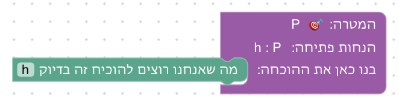
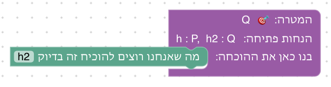

# יחידה 0 — היכרות עם הסביבה

**מטרה:** הסטודנט מכיר את חלקי המסך ואת מחזור העבודה: גוררים מהלך, קוראים את מצב ההוכחה, בודקים, ומתקנים שגיאה. במקביל הוא לומד את ההבחנה הבסיסית בין הנחה למטרה, ואת סגירת המטרה בעזרת הנחה שאומרת בדיוק אותה.

היחידה קצרה (כחמש דקות) ונלמדת דרך עשייה, לא דרך סיור מודרך: כל חלק במסך מוצג בשמו בטקסט הפתיחה של השלב שבו משתמשים בו לראשונה.

## חלקי המסך

| חלק | תפקיד | מוצג לראשונה |
|---|---|---|
| טקסט הפתיחה, וכרטיס העצמים, ההנחות והמטרה | מה צריך להוכיח בשלב, ומה נתון | שלב 0.1 |
| ארגז "מהלכי הוכחה" | הבלוקים הפתוחים בשלב הנוכחי | שלב 0.1 |
| בלוק המטרה | המטרה והנחות הפתיחה; לתוכו גוררים את מהלכי ההוכחה | שלב 0.1 |
| מצב ההוכחה: "מה יש לנו ביד" ו"מה נשאר להוכיח" | ההנחות והמטרה בנקודה הנוכחית בהוכחה | שלב 0.1 |
| כפתור "בדוק הוכחה" והודעת ההצלחה | בדיקת ההוכחה כולה, ומעבר לשלב הבא | שלב 0.1 |
| שדה בתוך בלוק | שם ההנחה שהמהלך משתמש בה; מתחיל כ־`?`, לוחצים ומקלידים | שלב 0.1 (מילוי); שלב 0.2 (תיקון) |
| סימון שגיאה: בלוק אדום, סמל ! והסבר בעברית | איפה ההוכחה נתקעה ולמה | שלב 0.2 |
| כפתור "הצג רמז" | רמזים הדרגתיים | שלב 0.2 |
| "לפני / אחרי המהלך" והסימון הכחול של המהלך הנבדק | מצב ההוכחה סביב מהלך מסוים | מוזכר בסיום שלב 0.1; מוסבר ביחידה 1, שלב 1 |

טקסט הסיום של שלב 0.1 מזכיר את "לפני / אחרי המהלך" על המהלך היחיד שבו (לפני "זה בדיוק" נשאר להוכיח את P, ואחריו לא נשאר דבר), כי הבחירה כבר מופיעה במסך. ההסבר המלא נדחה ליחידה 1: רק שם יש לראשונה שני מהלכים, והמהלך הראשון ("נניח") משנה את מצב ההוכחה כך שיש מה להשוות.

## הבלוקים

| בלוק | טקטיקת Lean | לפני → אחרי |
|---|---|---|
| מה שאנחנו רוצים להוכיח זה בדיוק h | `exact h` | `h : P ⊢ P` ⟶ סגור |

## שלבים

לכל שלב: מה לומדים בו, למה הוא בנוי כך, איך אנחנו רוצים שסטודנטים יפתרו אותו, ושיקולים ושאלות שעוד צריך להכריע. צילומי הפתרונות נוצרים מהקובץ `frontend/e2e/solutions.js` (`npm run docs:screenshots` בתיקייה `frontend`), ובדיקה אוטומטית מוודאת שכל פתרון מתקבל ובנוי רק מהבלוקים שבארגז של השלב.

### שלב 0.1: המטרה כבר בידינו

`h : P ⊢ P` · בארגז: זה בדיוק

**מה לומדים.** את מחזור העבודה כולו: פותחים את הארגז, גוררים בלוק אל בלוק המטרה, ממלאים בו שדה, קוראים את מצב ההוכחה ובודקים. ובלוגיקה: הנחה שאומרת בדיוק את המטרה סוגרת אותה.

**למה כך.** הצעד הלוגי הוא הפשוט ביותר, כדי שכל תשומת הלב תופנה לממשק. בארגז יש בלוק אחד בלבד, כך שאי אפשר לבחור בלוק לא נכון. השדה בבלוק מתחיל כ־`?` (ראו [עקרונות העיצוב](design/principles.md)), ולכן כבר בצעד הראשון הסטודנט בוחר בעצמו את ההנחה, ולא מקבל פתרון מוכן. טקסט הסיום מזכיר את "לפני / אחרי המהלך", כי הבחירה כבר מופיעה במסך.

**פתרון.** ההנחה h אומרת בדיוק את המטרה.

**שיקולים ושאלות להכרעה.**
- כשיש הנחה אחת בלבד, ההבחנה בין הנחה למטרה עוד לא נבחנת: אין ממה לבחור. שלב 0.2 נועד לכך. האם צריך גם כאן הנחה מסיחה?
- האם להשאיר את ההזכרה של "לפני / אחרי המהלך" כבר כאן, כשיש רק מהלך אחד, או לדחות אותה לגמרי ליחידה 1?

### שלב 0.2: בוחרים את ההנחה הנכונה

`h : P, h2 : Q ⊢ Q` · בארגז: זה בדיוק · השלב נפתח עם "זה בדיוק h" מחובר

**מה לומדים.** להבחין בין ההנחות למטרה ולבחור את ההנחה שאומרת בדיוק את המטרה; לקרוא סימון שגיאה (בלוק אדום, סמל ! והסבר בעברית) ולתקן שדה.

**למה כך.** המפגש הראשון עם שגיאה מתוכנן ומוסבר: השלב נפתח עם מהלך שגוי, כך שהסטודנט לומד שטעות היא חלק מהעבודה ולא מוחקת התקדמות (עיקרון 7 ב[עקרונות העיצוב](design/principles.md)). ההנחה המסיחה h : P נבחרה כך שהשגיאה היא בדיוק הבלבול שהשלב מלמד: הנחה נכונה, אבל לא זו שאומרת את המטרה.

**פתרון.** מתקנים את השדה מ־h ל־h2, ההנחה שאומרת Q.

**שיקולים ושאלות להכרעה.**
- הרמז האחרון אומר במפורש מה לכתוב (h2). האם סולם הרמזים צריך להסתיים בפתרון מלא, או להשאיר את הצעד האחרון לסטודנט?
- האם פתיחה עם שגיאה מוכנה מבלבלת סטודנט שעוד לא ניסה דבר בעצמו? חלופה: לתת לו לטעות בעצמו (למשל שתי הנחות, ואין בלוק מוכן) ולהסביר רק אם טעה.

בסוף שלב 0.2 כפתור "ליחידה 1" מעביר ישר לשלב הראשון של יחידה 1.

## שאלות כלליות להכרעה

- **דילוג:** האם סטודנט שכבר מכיר את הסביבה יכול לדלג ישר ליחידה 1?
- **סיווג כרטיסים:** בתכנון הקודם של יחידה 1 היה שלב 0 של סיווג כרטיסים להנחה או מטרה, עבור `P → P`. שלב 0.2 מכסה את אותה מטרה בתוך הבלוקים; תרגיל סיווג נפרד ידרוש ממשק משלו. האם הוא עדיין נחוץ?

