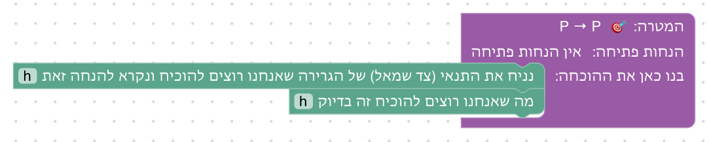
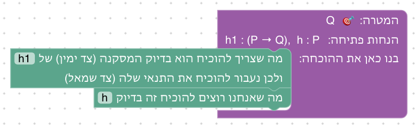
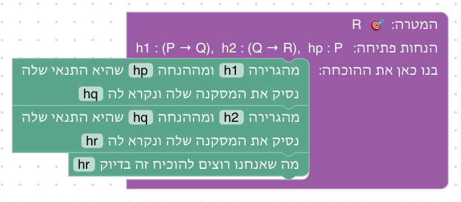
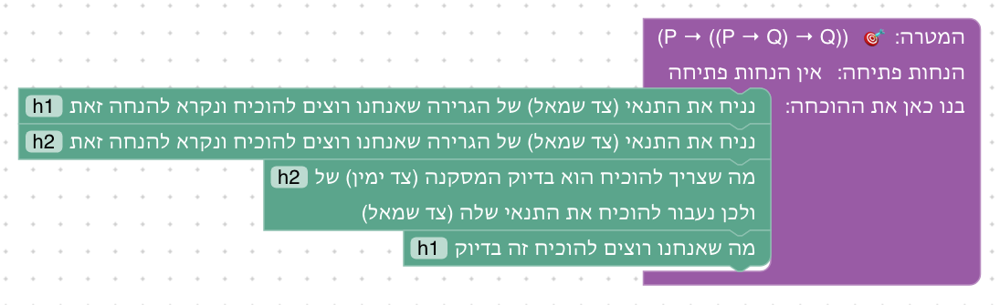
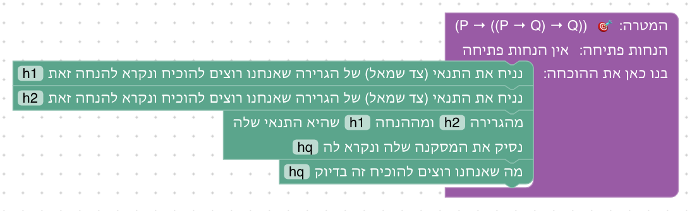
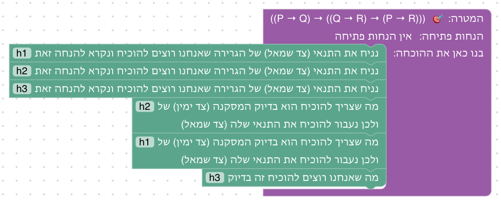
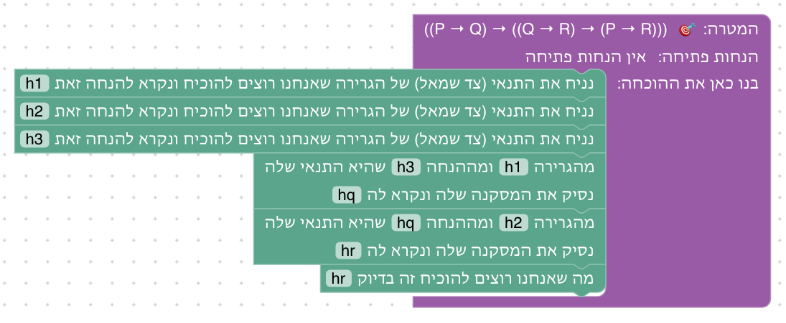

# יחידה 1 — מהנחה למסקנה

יחידה זו מגדירה את מטרות יחידה 1 ואת מיפוי הבלוקים למנוע האימות הפנימי.

**מטרה:** הוכחה ישירה של גרירות. הסטודנט מבדיל בין הנחה למטרה, מניח את P כדי להוכיח P → Q, משתמש בהנחה שמתאימה למטרה, ומשתמש בגרירה P → Q בשני הכיוונים: אחורה, כדי להחליף את המטרה Q ב-P, וקדימה, כדי להסיק מ-P את Q כהנחה חדשה.

## הבלוקים

| בלוק | טקטיקת Lean | לפני → אחרי |
|---|---|---|
| הוכחה (שורש) | `by` | – |
| נניח P ונקרא להנחה h | `intro h` | `⊢ P → Q` ⟶ `h : P ⊢ Q` |
| נשתמש בכלל h; נותר להוכיח את התנאי שלו | `apply h` | `h : P → Q ⊢ Q` ⟶ `⊢ P` |
| מהגרירה h ומההנחה hp שהיא התנאי שלה, נסיק את המסקנה שלה ונקרא לה hq (modus ponens) | `have hq := h hp` | `h : P → Q, hp : P` ⟶ גם `hq : Q` |
| המטרה נובעת ישירות מההנחה h (הוצג ביחידה 0) | `exact h` | `h : P ⊢ P` ⟶ סגור |

## שלבים

לכל שלב: מה לומדים בו, למה הוא בנוי כך, איך אנחנו רוצים שסטודנטים יפתרו אותו, ושיקולים ושאלות שעוד צריך להכריע. צילומי הפתרונות נוצרים מ־`frontend/e2e/solutions.js` (ראו [יחידה 0](00-getting-started.md#שלבים)).

**קדימה ואחורה.** ביחידה הזאת משתמשים בגרירה בשתי דרכים, ושתיהן נלמדות במפורש. *אחורה* (שלב 1.2): המסקנה של הגרירה היא המטרה, ולכן עוברים להוכיח את התנאי שלה. *קדימה* (שלב 1.3, modus ponens, ‎→E בדדוקציה טבעית): התנאי בידינו, ולכן מסיקים את המסקנה כהנחה חדשה, והמטרה לא משתנה. Logic and Proof ממליץ להתחיל אחורה מהמטרה ואז להתקדם קדימה מההנחות; בהוכחה כתובה שתי הדרכים נפוצות. מכאן ואילך, בכל שלב שיש בו "זה בדיוק", גם ההסקה קדימה זמינה, ולהפך: הנחה שהיא מסיקה נסגרת דרך "זה בדיוק", ובלעדיו היא מיותרת (`levels.test.js` מוודא זאת).

### שלב 1.1: אותה טענה משני הצדדים

`⊢ P → P` · בארגז: נניח, זה בדיוק

**מה לומדים.** להוכיח גרירה: מניחים את התנאי ונותנים לו שם, ונשאר להוכיח את המסקנה. וגם "לפני / אחרי המהלך": לחיצה על מהלך מראה איך הוא שינה את ההנחות ואת המטרה.

**למה כך.** הטענה P → P היא הפשוטה ביותר שיש בה גרירה, כך שהרעיון החדש היחיד הוא הנחת התנאי; הסגירה ב"זה בדיוק" כבר מוכרת מיחידה 0. זה גם השלב הראשון עם שני מהלכים, ולכן המקום הטבעי להסביר את "לפני / אחרי": אחרי "נניח" יש מה להשוות.

**פתרון.** מניחים את התנאי, וסוגרים בעזרתו.

**שיקולים ושאלות להכרעה.**
- P → P נראית טריוויאלית. Massot מדווח שסטודנטים מאבדים עניין בהוכחת טאוטולוגיות ריקות. האם להציג כבר כאן דוגמה מילולית (למשל "אם יורד גשם, אז יורד גשם") כדי לעגן את המשמעות?
- הסטודנט בוחר את שם ההנחה בעצמו. האם להמליץ על מוסכמת שמות (h, h1, hp...), או להשאיר חופש מלא?

### שלב 1.2: שימוש בגרירה: מחליפים את המטרה

`h1 : P → Q, h : P ⊢ Q` · בארגז: מעבר לתנאי, זה בדיוק

**מה לומדים.** שימוש בגרירה אחורה: אם המסקנה של גרירה היא בדיוק המטרה, מספיק להוכיח את התנאי שלה.

**למה כך.** ההנחות נתונות מראש, בלי "נניח", כדי שהשלב יתמקד ברעיון אחד: החלפת המטרה. כיתוב הבלוק מנסח גם את התנאי לשימוש בו ("מה שצריך להוכיח הוא בדיוק המסקנה של..."), כך שהבלוק עצמו מלמד מתי מותר להשתמש בו. אם המסקנה לא זהה למטרה, ההסבר אומר זאת במונחי הגרירה.

**פתרון.** המסקנה של h1 היא המטרה, ולכן עוברים לתנאי שלה, P, וסוגרים בעזרת h.

**שיקולים ושאלות להכרעה.**
- מאחורי הקלעים הבלוק מייצר `apply`, שעובד גם על גרירה עם כמה תנאים (`P → Q → R`) ויוצר אז כמה מטרות. ביחידה 1 מוגבלים לגרירה עם תנאי אחד. האם הבלוק צריך לסרב לגרירה עם כמה תנאים?
- כיתוב הבלוק ארוך (שתי שורות) ותופס רוחב בהוכחות מקוננות. האם לקצר אותו, למשל "המטרה היא המסקנה של h; נעבור לתנאי שלה"?

### שלב 1.3: מסיקים קדימה

`h1 : P → Q, h2 : Q → R, hp : P ⊢ R` · בארגז: הסקה קדימה, זה בדיוק

**מה לומדים.** שימוש בגרירה קדימה: מהגרירה ומהתנאי שלה מסיקים את המסקנה, ומוסיפים אותה להנחות.

**למה כך.** שרשרת של שתי גרירות, כך שקדימה הוא הכיוון הטבעי: מתחילים ממה שיש ביד. בארגז יש רק הסקה קדימה ו"זה בדיוק", כדי שהסטודנט יתרגל את הצעד החדש ולא יחזור לדרך המוכרת משלב 1.2. טקסט השלב והסיום משווים במפורש בין שתי הדרכים.

**פתרון.** מ־P מסיקים את Q, ומ־Q את R.

**שיקולים ושאלות להכרעה.**
- סדר: אחורה (1.2) לפני קדימה (1.3). ספרים רבים מתחילים דווקא ב־modus ponens קדימה, שהוא הכלל המוכר יותר. מה עדיף לקהל שלנו?
- האם כדאי ששלבים 1.2 ו־1.3 יהיו אותו תרגיל בדיוק, כדי שההשוואה בין הדרכים תהיה ישירה יותר?

### שלב 1.4: קוראים את המטרה לפי הסדר

`⊢ P → ((P → Q) → Q)` · בארגז: נניח, מעבר לתנאי, הסקה קדימה, זה בדיוק

**מה לומדים.** לקרוא מטרה מקוננת: גרירה שהמסקנה שלה היא שוב גרירה. מניחים את התנאים לפי הסדר, ואז משתמשים בגרירה שהונחה, בכל אחת משתי הדרכים.

**למה כך.** ההנחות לא נתונות מראש; הסטודנט מייצר אותן בעצמו. בארגז שתי הדרכים, והטקסט מציע את שתיהן, כדי שהבחירה ביניהן תהיה של הסטודנט.

**פתרון א: אחורה.** אחרי שתי ההנחות, המסקנה של h2 היא המטרה.

**פתרון ב: קדימה.** אחרי שתי ההנחות, מ־h2 ומ־h1 מסיקים את Q.

**שיקולים ושאלות להכרעה.**
- המטרה מוצגת עם סוגריים מלאים, כדי שלא יהיה צורך לדעת שהחץ מתקבץ לימין. האם בהמשך הקורס כדאי ללמד את מוסכמת הקיבוץ ולהוריד סוגריים?

### שלב 1.5: שרשרת של שלוש הנחות

`⊢ (P → Q) → ((Q → R) → (P → R))` · בארגז: נניח, מעבר לתנאי, הסקה קדימה, זה בדיוק

**מה לומדים.** תרגיל מסכם: שלוש הנחות, ושימוש בשתי גרירות ברצף (טרנזיטיביות של הגרירה).

**למה כך.** אותה שרשרת כמו בשלב 1.3, אבל הפעם הסטודנט מניח הכול בעצמו ובוחר כיוון. ההשוואה לשלב 1.3 מראה שהמבנה הלוגי זהה, ורק מקור ההנחות שונה.

**פתרון א: אחורה.** מהמטרה R אחורה: דרך h2 ל־Q, ודרך h1 ל־P.

**פתרון ב: קדימה.** מ־P קדימה: דרך h1 ל־Q, ודרך h2 ל־R.

**שיקולים ושאלות להכרעה.**
- האם השלב מוסיף מספיק מעבר לשלב 1.3 ו־1.4, או שכדאי להחליף אותו בתרגיל שמחייב לשלב בין הדרכים (למשל גרירה עם תנאי שהוא בעצמו גרירה)?
- האם להוסיף שלב בונוס, כמו ביחידות 2 ו־3?

## שאלות כלליות להכרעה

- ההבחנה בין הנחה למטרה ובלוק "זה בדיוק" עברו ליחידה 0, כך ששלב 1 מציג רק את "נניח". שלב 1 הוא גם המקום להציג את "לפני / אחרי המהלך" ואת הסימון הכחול של המהלך הנבדק, כי רק בו יש לראשונה שני מהלכים.
- `exact h` דורש התאמה מדויקת עד כדי הגדרות. בחירה בין `exact` ל-`assumption` נתונה להחלטה ([החלטות פתוחות](design/open-decisions.md)).

