# יחידה 2 — וגם, או, אם ורק אם

**מטרה:** שימוש בכל אחד מהקשרים "וגם", "או" ו"אם ורק אם" והוכחה שלו. הסטודנט מבדיל בין שימוש בקשר (בהנחה) לבין הוכחה שלו (במטרה), מוכיח טענה בכמה חלקים, ומוכיח בחלוקה למקרים.

## הבלוקים

בלוק אחד לכל כלל: הוכחה ושימוש לכל קשר. עמודת Lean מציגה את מה שהבלוק מייצר מאחורי הקלעים.

| כלל | כיתוב הבלוק | Lean | לפני → אחרי |
|---|---|---|---|
| הוכחת P ∧ Q | נוכיח כל אחד משני הצדדים של ה"וגם" לחוד; צד שמאל: … צד ימין: … | `apply And.intro` | `⊢ P ∧ Q` ⟶ שני חלקים: `⊢ P`, `⊢ Q` |
| שימוש בהנחת P ∧ Q | מההנחה h מסוג "וגם" נסיק את שני הצדדים שלה: צד שמאל, ונקרא לו h1, וצד ימין, ונקרא לו h2 | `have h1 := And.left h` ו־`have h2 := And.right h` | `h : P ∧ Q` ⟶ גם `h1 : P`, `h2 : Q` |
| הוכחת P ∨ Q | כדי להוכיח את ה"או", נוכיח את צד שמאל / ימין שלו | `apply Or.inl` / `apply Or.inr` | `⊢ P ∨ Q` ⟶ `⊢ P` או `⊢ Q` |
| שימוש בהנחת P ∨ Q | נחלק למקרים לפי ההנחה h מסוג "או": מקרה ראשון: צד שמאל נכון, ונקרא לו h1 … מקרה שני: צד ימין נכון, ונקרא לו h2 … | `cases h with \| inl h1 => … \| inr h2 => …` | שני חלקים, בכל אחד הנחה אחרת |
| הוכחת P ↔ Q | נוכיח את שני הכיוונים של ה"אם ורק אם" לחוד; כיוון ראשון, משמאל לימין (→): … כיוון שני, מימין לשמאל (←): … | `apply Iff.intro` | שני חלקים: `⊢ P → Q`, `⊢ Q → P` |
| שימוש בהנחת P ↔ Q | מההנחה h מסוג "אם ורק אם" נסיק את שני הכיוונים שלה | `have h1 := Iff.mp h` ו־`have h2 := Iff.mpr h` | `h : P ↔ Q` ⟶ גם `h1 : P → Q`, `h2 : Q → P` |

**חלקים כתתי-בלוקים** ([החלטה 10](design/open-decisions.md)): לבלוק שמפצל את ההוכחה יש מקום נפרד לכל חלק, ובו בונים את ההוכחה של אותו חלק. לחיצה על מהלך בתוך חלק מציגה את מצב ההוכחה של אותו חלק בלבד. אחרי בלוק מפצל, מצב ההוכחה מציג את החלקים זה לצד זה, כל אחד עם ההנחות והמטרה שלו ("צד שמאל", "מקרה ראשון", "כיוון ראשון (→)" וכו').

**כלל ספציפי לכל קשר:** כל בלוק מייצר את כלל ההוכחה או השימוש של הקשר שלו, ולא טקטיקה כללית. טקטיקות כלליות מקבלות מהלכים שגויים מבחינה לוגית: למשל `constructor` על מטרה `P ∨ Q` בוחר בשקט את צד שמאל, ו־`obtain ⟨h1, h2⟩` מפרק גם הנחת "או" וגם הנחת "אם ורק אם". עם הכלל הספציפי, מהלך על הקשר הלא נכון נכשל, וההסבר מנוסח במונחי הקשר (למשל: "המטרה היא (P ∨ Q), והיא לא טענת "וגם", ולכן אין לה שני צדדים להוכיח לחוד").

**ההנחה נשארת:** שימוש ב"וגם" או ב"אם ורק אם" מוסיף את שני החלקים כהנחות חדשות, וההנחה המקורית נשארת ביד, כמו בהוכחה כתובה ("מ־h נובע P, ונובע Q").

## שלבים

לכל שלב: מה לומדים בו, למה הוא בנוי כך, איך אנחנו רוצים שסטודנטים יפתרו אותו, ושיקולים ושאלות שעוד צריך להכריע. צילומי הפתרונות נוצרים מ־`frontend/e2e/solutions.js` (ראו [יחידה 0](00-getting-started.md#שלבים)).

**סדר היחידה.** לכל קשר מלמדים קודם שימוש ואחר כך הוכחה: "וגם" (2.1–2.3), "או" (2.4–2.6), "אם ורק אם" (2.7–2.8), ובונוס שמשלב הכול (2.9). רוב המקורות מלמדים "וגם", "אם ורק אם" ו"או" בסדר הזה; כאן "או" בא לפני "אם ורק אם", כדי שהוכחת "אם ורק אם" תסכם את היחידה (ראו [רקע](#רקע-מה-עושים-מדריכים-אחרים)).

### שלב 2.1: משתמשים בהנחה מסוג "וגם"

`h : P ∧ Q ⊢ Q` · בארגז: שימוש ב"וגם", זה בדיוק

**מה לומדים.** מהנחה "P וגם Q" נובע כל אחד מהצדדים, וכל צד הוא הנחה בפני עצמה.

**למה כך.** מתחילים בשימוש ב"וגם", כמו רוב המקורות, כי הוא הכלל האינטואיטיבי ביותר. המטרה היא צד ימין, Q, ולא צד שמאל, כדי שלא אפשר יהיה לנחש לפי הסדר. ההנחה המקורית נשארת ביד אחרי הפירוק, כמו בהוכחה כתובה.

**פתרון.** מסיקים מ־h את שני הצדדים, וסוגרים בצד ימין.

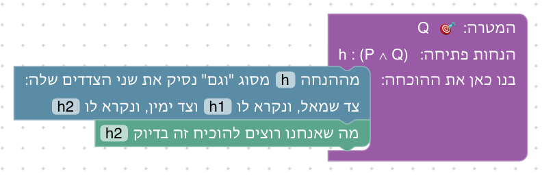

**שיקולים ושאלות להכרעה.**
- הבלוק מסיק תמיד את שני הצדדים, גם כשצריך רק אחד. האם כדאי שני בלוקים נפרדים ("נסיק את צד שמאל", "נסיק את צד ימין"), כמו שני כללי ∧E בדדוקציה טבעית?

### שלב 2.2: מוכיחים טענה מסוג "וגם"

`h1 : P, h2 : Q ⊢ P ∧ Q` · בארגז: הוכחת "וגם", זה בדיוק

**מה לומדים.** כדי להוכיח "P וגם Q" מוכיחים את שני הצדדים לחוד. זה הבלוק הראשון שמפצל את ההוכחה לחלקים, וכל חלק נבנה במקום משלו בבלוק.

**למה כך.** ההנחות נתונות, כדי שהרעיון החדש היחיד יהיה הפיצול. זה גם המקום להראות שלחיצה על מהלך בתוך חלק מציגה את מצב ההוכחה של אותו חלק בלבד, ושאחרי הפיצול החלקים מוצגים זה לצד זה.

**פתרון.** כל צד בחלק משלו.

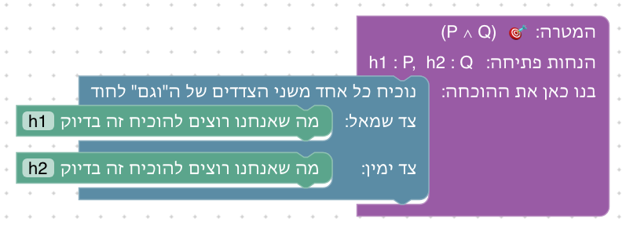

**שיקולים ושאלות להכרעה.**
- הבלוק "צירוף ל'וגם'" (הוכחת "וגם" קדימה) מושמט בכוונה מהשלב הזה: הוא היה מאפשר לעקוף את הפיצול, שהוא בדיוק מה שהשלב מלמד. הוא מוצג בשלב 2.3.
- הסטודנטים פוגשים כאן לראשונה בלוק עם מקומות פנימיים. האם צריך הדגמה (למשל אנימציה קצרה של גרירה לתוך חלק), או שהטקסט מספיק?

### שלב 2.3: מחליפים את הצדדים

`⊢ (P ∧ Q) → (Q ∧ P)` · בארגז: נניח, שימוש ב"וגם", הוכחת "וגם", צירוף ל"וגם", זה בדיוק

**מה לומדים.** להשתמש ב"וגם" ולהוכיח "וגם" באותה הוכחה, ולהבחין בין השניים: את ההנחה מפרקים, ואת המטרה מפצלים. ובלוק חדש: צירוף שתי הנחות ל"וגם" אחד, כלומר הוכחת "וגם" קדימה.

**למה כך.** טענת החילוף היא דוגמה קלאסית (D∃∀duction, Logic Game), שבה שני הכללים נחוצים יחד. היא גם בסיס לשלב 2.8, שבו כל כיוון זהה להוכחה הזאת.

**פתרון א: אחורה.** משתמשים ב"וגם" שבהנחה, ומוכיחים "וגם" בשני חלקים.

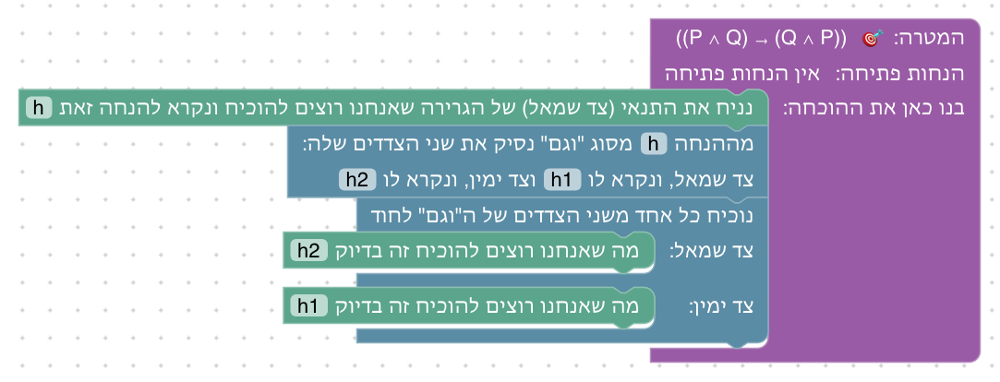

**פתרון ב: קדימה.** מסיקים את שני הצדדים, ומצרפים אותם בסדר ההפוך.

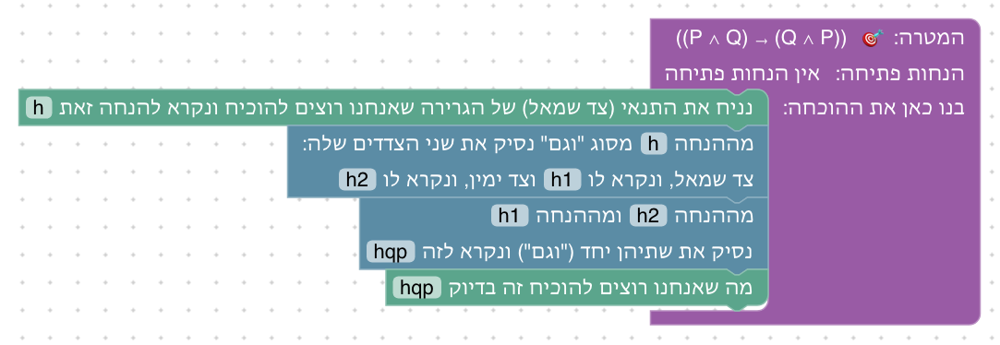

**שיקולים ושאלות להכרעה.**
- הצירוף ל"וגם" מופיע לראשונה כאן, ולא בשלב 2.2, שבו היה עוקף את הלקח. הוא מוסיף דרך שנייה, אבל גם מאפשר לסטודנט לא לתרגל את הפיצול. האם זה מקובל כאן, אחרי שהפיצול כבר נלמד?
- סדר המהלכים: אפשר גם לפצל את המטרה קודם, ולפרק את ההנחה בתוך כל חלק. האם להראות גם את הדרך הזאת, כדי להמחיש שסדר המהלכים לא תמיד חשוב?

### שלב 2.4: מוכיחים טענה מסוג "או"

`h : P ⊢ Q ∨ P` · בארגז: צד שמאל, צד ימין, זה בדיוק

**מה לומדים.** כדי להוכיח "או" מספיק להוכיח צד אחד, אבל צריך לבחור את הצד שאפשר להוכיח.

**למה כך.** הצד הנכון הוא צד ימין, כדי שבחירה אוטומטית בצד שמאל תיכשל. הטקסט שואל "איזה צד כדאי לבחור?" לפני שהסטודנט מתחיל, והסיום מסביר מה היה קורה אילו בחר אחרת. זו ההכנה לשלב 2.6.

**פתרון.** בוחרים את הצד שאפשר להוכיח, P.

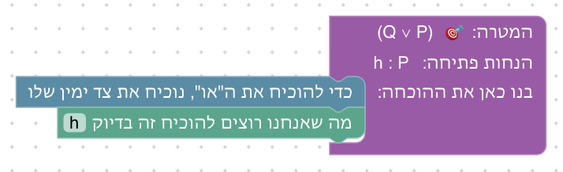

**שיקולים ושאלות להכרעה.**
- בחירה בצד שמאל לא מסומנת כשגיאה (המהלך תקף), אבל אחריה אין דרך להמשיך. האם לזהות מצב "תקוע" ולהציע רמז, או להשאיר לסטודנט לגלות זאת בעצמו?

### שלב 2.5: חלוקה למקרים

`hpr : P → R, hqr : Q → R, h : P ∨ Q ⊢ R` · בארגז: חלוקה למקרים, מעבר לתנאי, הסקה קדימה, זה בדיוק

**מה לומדים.** הוכחה בחלוקה למקרים: מ"P או Q" לא יודעים איזה צד נכון, ולכן מוכיחים את המטרה בכל אחד מהמקרים.

**למה כך.** אותה מטרה R בשני המקרים, ובכל מקרה ההנחה החדשה היא התנאי של אחת הגרירות. כך המבנה של חלוקה למקרים בולט, ושאר ההוכחה מוכרת מיחידה 1. ההנחות הנתונות נקראות hpr ו־hqr, ולא h1 ו־h2, כדי שהשמות הטבעיים יישארו פנויים למקרים.

**פתרון א: אחורה.** בכל מקרה, המסקנה של הגרירה המתאימה היא R.

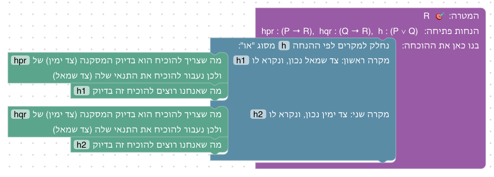

**פתרון ב: קדימה.** בכל מקרה, ההנחה החדשה היא התנאי של אחת הגרירות.

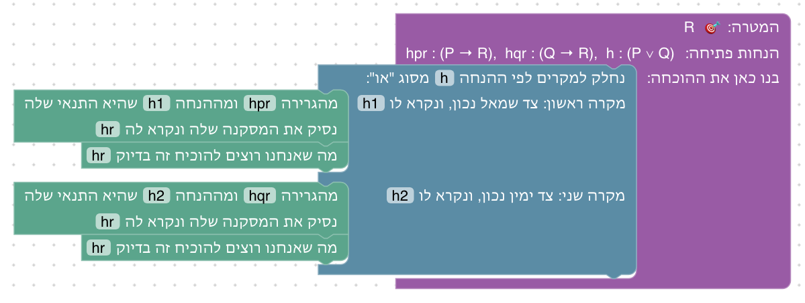

**שיקולים ושאלות להכרעה.**
- Set Theory Game מלמד את אותו כלל דרך קבוצות (A ⊆ C, B ⊆ C ⊢ A ∪ B ⊆ C). האם להוסיף גרסה כזאת כאן, או ביחידה 5?

### שלב 2.6: קודם מקרים, אחר כך צד

`⊢ (P ∨ Q) → (Q ∨ P)` · בארגז: נניח, חלוקה למקרים, צד שמאל, צד ימין, זה בדיוק · השלב נפתח עם "נניח" ובחירה בצד שמאל מחוברים

**מה לומדים.** כשמשתמשים ב"או" כדי להוכיח "או", קודם מחלקים למקרים, ורק בתוך כל מקרה בוחרים צד.

**למה כך.** זו הטעות הנפוצה ביותר ב"או" לפי HTPI, forall x ו־Set Theory Game: בחירת צד מוקדמת מדי. השלב נפתח עם הטעות הזאת כבר מחוברת. המהלך לא שגוי, ולכן אין סימון אדום, אבל במצב ההוכחה רואים שנשאר להוכיח Q, ואין דרך. הסטודנט מוציא את הבלוק ובונה מחדש (עיקרון 7 ב[עקרונות העיצוב](design/principles.md), כמו בשלב 0.2).

**פתרון.** קודם מקרים, ורק בתוך כל מקרה בוחרים צד.

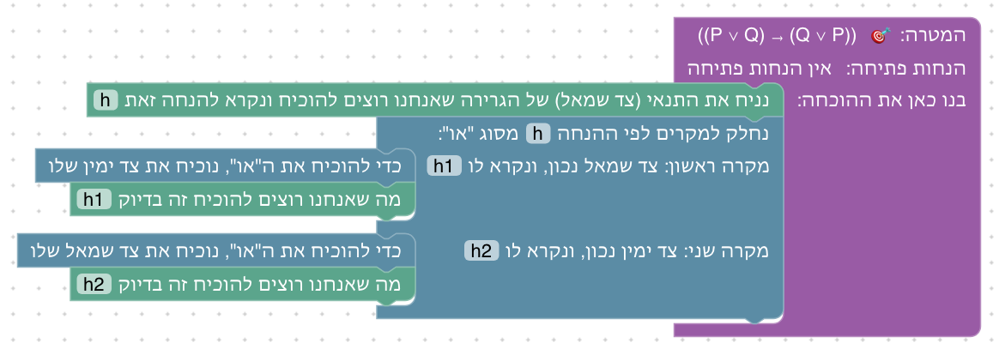

**שיקולים ושאלות להכרעה.**
- המהלך התקוע לא מסומן, כי הוא לא שגוי. האם הסטודנט יבין לבד שהוא תקוע, או שצריך סימון עדין ("אין דרך להוכיח את Q מההנחות")? זיהוי אוטומטי של מצב תקוע אינו פשוט באופן כללי.
- הסטודנט צריך לגרור בלוק לפח, פעולה שלא נלמדה קודם. האם להסביר אותה כבר ביחידה 0?

### שלב 2.7: משתמשים בהנחה מסוג "אם ורק אם"

`h : P ↔ Q, hq : Q ⊢ P` · בארגז: שימוש ב"אם ורק אם", מעבר לתנאי, הסקה קדימה, זה בדיוק

**מה לומדים.** "P אם ורק אם Q" הוא שתי גרירות. מהנחה כזאת מסיקים את שתיהן, ומשתמשים בכל אחת כמו בכל גרירה.

**למה כך.** כל המקורות מלמדים "אם ורק אם" כשתי גרירות. הכיוון הנחוץ כאן הוא מימין לשמאל, Q → P, כדי שלא אפשר יהיה להשתמש באופן אוטומטי בכיוון הראשון.

**פתרון א: אחורה.** משתמשים בכיוון מימין לשמאל, Q → P, אחורה.

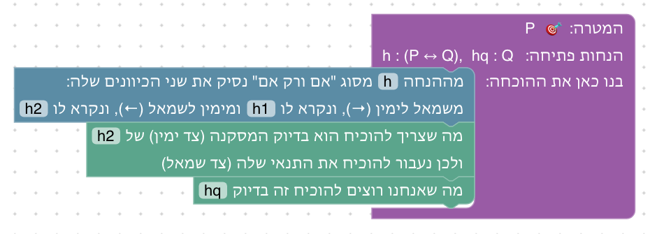

**פתרון ב: קדימה.** התנאי Q בידינו, ולכן מסיקים את P.

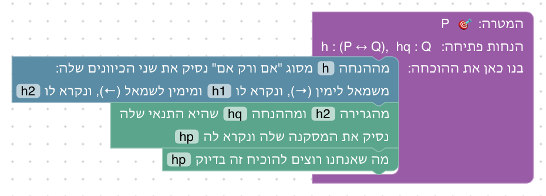

**שיקולים ושאלות להכרעה.**
- D∃∀duction מבקש מהסטודנט לבחור כיוון אחד בלבד ("To use this equivalence, you first have to prove one of both properties"). כאן מסיקים תמיד את שני הכיוונים. האם עדיף לבחור כיוון?

### שלב 2.8: מוכיחים טענה מסוג "אם ורק אם"

`⊢ (P ∧ Q) ↔ (Q ∧ P)` · בארגז: הוכחת "אם ורק אם", נניח, שימוש ב"וגם", הוכחת "וגם", צירוף ל"וגם", זה בדיוק

**מה לומדים.** כדי להוכיח "אם ורק אם" מוכיחים את שני הכיוונים לחוד; כל כיוון הוא גרירה.

**למה כך.** כל כיוון זהה להוכחה משלב 2.3, כך שהרעיון החדש היחיד הוא הפיצול לשני כיוונים. D∃∀duction משתמש באותה טענה, ומציע להשתמש שוב בתרגיל הקודם.

**פתרון א: אחורה.** שני הכיוונים, כל אחד כמו שלב 2.3.

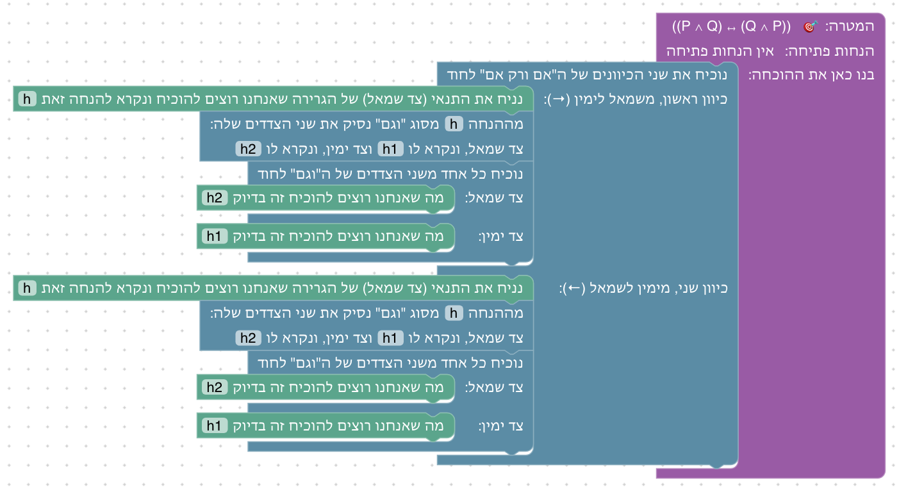

**פתרון ב: קדימה.** בכל כיוון מצרפים את שני הצדדים בסדר ההפוך.

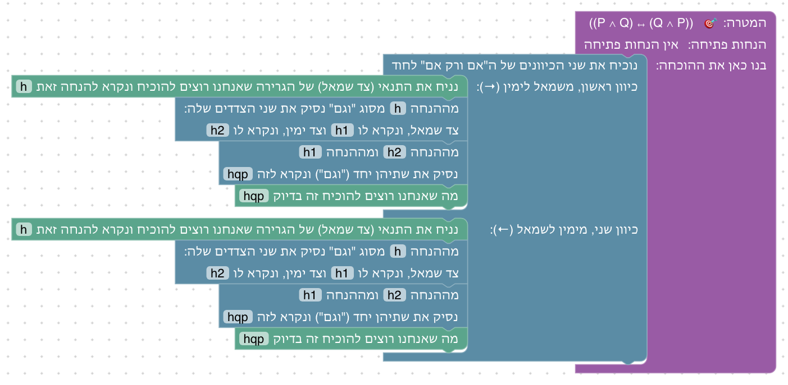

**שיקולים ושאלות להכרעה.**
- הסטודנט בונה פעמיים את אותה הוכחה. אפשר לאפשר שימוש בטענה שכבר הוכחה בשלב קודם (כמו ב־D∃∀duction). זה דורש מנגנון של "טענות שהוכחו" שעוד אין לנו. האם הוא שווה את המאמץ?
- ההוכחה רחבה מאזור העבודה בגודל הרגיל. האם לקצר את כיתוב "נניח", שהוא הארוך ביותר?

### שלב 2.9: שלב בונוס: פילוג

`⊢ (P ∧ (Q ∨ R)) → ((P ∧ Q) ∨ (P ∧ R))` · בארגז: נניח, שימוש ב"וגם", הוכחת "וגם", צירוף ל"וגם", חלוקה למקרים, צד שמאל, צד ימין, זה בדיוק

**מה לומדים.** לשלב את כל כללי היחידה בהוכחה מקוננת אחת.

**למה כך.** "וגם" מתפלג על "או" הוא אתגר מוכר (Logic Game, D∃∀duction). השלב גם מתרגל שוב את הלקח של 2.6: בוחרים צד רק בתוך כל מקרה. הטקסט מזכיר לתת שמות חדשים למקרים, כי h1 ו־h2 כבר תפוסים.

**פתרון א: אחורה.** מקרים לפי h2, ובכל מקרה בוחרים צד ומוכיחים "וגם" בשני חלקים.

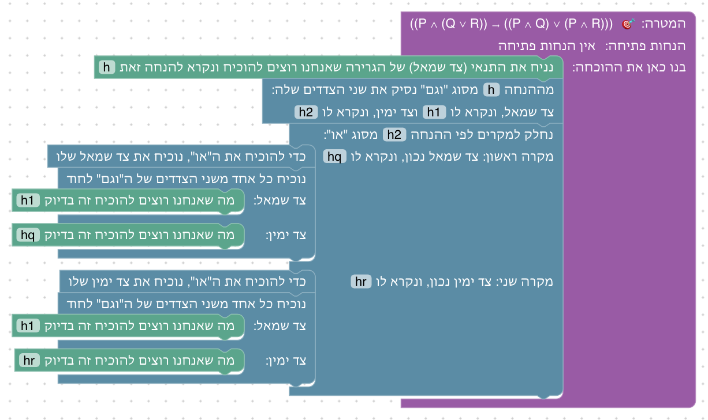

**פתרון ב: קדימה.** בכל מקרה בוחרים צד, ומצרפים את h1 להנחה של המקרה.

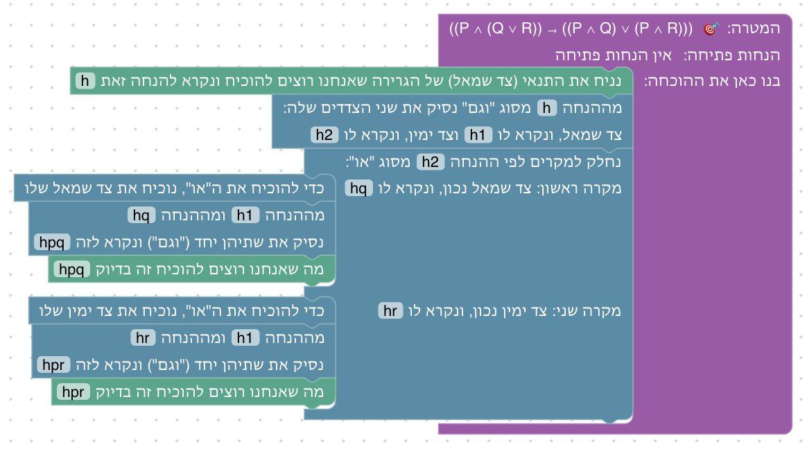

**שיקולים ושאלות להכרעה.**
- האם להוסיף גם את הכיוון ההפוך של הפילוג, שהוא קשה יותר (שתי חלוקות למקרים)?

## רקע: מה עושים מדריכים אחרים

סקירה (2026-10-02) של מדריכים שמלמדים לוגיקה בעזרת עוזר הוכחה, ושל ספרי לוגיקה:
- [Verbose Lean](https://github.com/PatrickMassot/verbose-lean4) ([מאמר](https://drops.dagstuhl.de/entities/document/10.4230/LIPIcs.ITP.2024.27))
- [Waterproof](https://arxiv.org/abs/2211.13513)
- [D∃∀duction](https://github.com/dEAduction/dEAduction)
- [Logic Game](https://github.com/Trequetrum/lean4game-logic)
- [Set Theory Game](https://github.com/djvelleman/STG4)
- [How To Prove It with Lean](https://djvelleman.github.io/HTPIwL/Chap3.html)
- [Mathematics in Lean](https://leanprover-community.github.io/mathematics_in_lean/C03_Logic.html)
- [The Mechanics of Proof](https://hrmacbeth.github.io/math2001/02_Proofs_with_Structure.html)
- [Logic and Proof](https://leanprover-community.github.io/logic_and_proof/natural_deduction_for_propositional_logic.html)
- [forall x](https://forallx.openlogicproject.org/html/Ch17.html)

מה לקחנו מהן:
- **סדר:** רוב המקורות מלמדים "וגם", אחר כך "אם ורק אם", ואחר כך "או". כולם מלמדים את "אם ורק אם" כשתי גרירות, ורבים מתחילים בשימוש ב"וגם" (P ∧ Q → P). כאן "או" בא לפני "אם ורק אם", כדי ששלב "אם ורק אם" יסכם את היחידה.
- **שימוש מול הוכחה:** כל המקורות מפרידים בין שימוש בקשר להוכחה שלו, כמהלכים נפרדים.
- **בחירת צד מוקדמת מדי:** זו הטעות הנפוצה ביותר ב"או" (HTPI, forall x, Set Theory Game): קודם מחלקים למקרים, ורק אחר כך בוחרים צד. ממנה נולד שלב 2.6.
- **ניסוח:** הכיתובים מבוססים על Verbose Lean ועל Waterproof: "we show both statements", "we show both directions", "we discuss using h".
- **כל חלק מסומן:** ב־Waterproof ובמאמר של Verbose Lean, כל חלק של ההוכחה מתחיל בהכרזה על המטרה שלו. כאן כל חלק מסומן בבלוק ("צד שמאל:", "מקרה ראשון: …"), והמטרה שלו מוצגת במצב ההוכחה.
- **פתוח:** אזהרת Massot, שסטודנטים מאבדים עניין בהוכחת טאוטולוגיות ריקות. Set Theory Game מלמד את אותם כללים דרך שייכות לקבוצות (x ∈ A ∩ B). ראו הערות לדיון.

## שאלות כלליות להכרעה

- **שם שכבר בשימוש:** כל שדה מתחיל כ־`?`, והסטודנט בוחר את שמות ההנחות החדשות. אם הוא בוחר שם שכבר קיים, ההנחה הישנה מוסתרת, ומהלכים מאוחרים יותר מתייחסים לחדשה בלי שהוא מבין למה. האם לבדוק ולהזהיר על כך?
- **טאוטולוגיות מול קבוצות:** האם להוסיף לכל כלל גם תרגיל בגרסת קבוצות (A ∩ B ⊆ B ∩ A), או להשאיר את זה ליחידה 5?

