# יחידה 3 — שלילה והוכחה בשלילה

**מטרה:** הסטודנט מגיע לסתירה מטענה ושלילתה, מוכיח שלילה (מניח את הטענה ומגיע לסתירה), משתמש בשלילה (כדי להגיע לסתירה מוכיח את מה שהיא שוללת), מבחין בין הוכחת שלילה לבין *הוכחה בשלילה*, ובודק את שתי האפשרויות של טענה (חוק השלישי מן הנמנע).

## הבלוקים

`¬P` פירושו "P מובילה לסתירה". הסתירה (`False` ב־Lean) מוצגת כ"סתירה (⊥)".

| כלל | כיתוב הבלוק | Lean | לפני → אחרי |
|---|---|---|---|
| סתירה (¬E) | ההנחה hn היא השלילה של ההנחה hp, ולכן הגענו לסתירה | `exact (absurd hp hn : False)` | `hp : P, hn : ¬P ⊢ ⊥` ⟶ סגור |
| עיקרון הסתירה | נשתמש בעיקרון הסתירה: הטענה P ושלילתה גוררות סתירה, ונקרא לגרירה הזאת hc | `have hc : ((P) ∧ ¬(P)) → False := …` | מוסיף `hc : (P ∧ ¬P) → ⊥` |
| צירוף ל"וגם" | מההנחה hp ומההנחה hn נסיק את שתיהן יחד ("וגם") ונקרא לזה hpn | `have hpn := And.intro hp hn` | מוסיף `hpn : P ∧ ¬P` (הכלל ∧I, קדימה) |
| סתירה גוררת כל טענה | נשתמש בגרירה: סתירה גוררת Q, ונקרא לה hf | `have hf : False → (Q) := False.elim` | מוסיף `hf : ⊥ → Q`; עם "מעבר לתנאי של גרירה" (יחידה 1) ⟶ `⊢ ⊥` |
| הוכחת שלילה (¬I) | נוכיח את השלילה: נניח את הטענה שהיא שוללת, ונקרא לה h, ונגיע לסתירה | `apply Not.intro` ו־`intro h` | `⊢ ¬P` ⟶ `h : P ⊢ ⊥` |
| שימוש בשלילה | נגיע לסתירה בעזרת השלילה hn, ולכן נוכיח את הטענה שהיא שוללת | `refine (absurd ?_ hn : False)` | `hn : ¬P ⊢ ⊥` ⟶ `⊢ P` |
| הוכחה בשלילה | נוכיח בשלילה: נניח שהמטרה לא נכונה, ונקרא לזה h, ונגיע לסתירה | `apply Classical.byContradiction` ו־`intro h` | `⊢ P` ⟶ `h : ¬P ⊢ ⊥` |
| שתי אפשרויות | נבדוק את שתי האפשרויות: הטענה P נכונה או לא נכונה; אם היא נכונה, נקרא לזה h1: … אם היא לא נכונה, נקרא לזה h2: … | `cases Classical.em (P) with \| inl h1 => … \| inr h2 => …` | שני חלקים: `h1 : P`, `h2 : ¬P` |

**כלל ספציפי:** כמו ביחידה 2, כל בלוק נכשל כשמשתמשים בו במקום הלא נכון, וההסבר מנוסח במונחי הכלל. "הגענו לסתירה" סוגר רק מטרה שהיא סתירה. כדי לסגור בו מטרה אחרת Q, מוסיפים את הגרירה ⊥ → Q ועוברים להוכיח את התנאי שלה, ולכן שני הכללים נלמדים בנפרד. הוכחת שלילה מתאימה רק למטרה שהיא שלילה. גם "שימוש בשלילה" דורש שהמטרה תהיה סתירה ושההנחה תהיה שלילה.

**בלי Mathlib:** כל הכללים קיימים ב־Lean הבסיסי. `by_contra` ו־`push_neg` דורשים Mathlib, ובמקומם משתמשים ב־`Classical.byContradiction`. לקורס בלוגיקה עדיף שהסטודנטים יוכיחו את חוקי דה מורגן בעצמם (שלבים 3.5 ו־3.8), במקום שבלוק `push_neg` יעשה זאת אוטומטית.

**"מסתירה נובע הכול" כגרירה:** במקום מהלך שמחליף את המטרה בסתירה (`exfalso`), הבלוק מוסיף את הגרירה הנכונה תמיד ⊥ → Q, ואז משתמשים במהלך המוכר מיחידה 1, "מעבר לתנאי של גרירה". כך עיקרון חדש מוצג כטענה לוגית, והמהלך שמשתמש בו כבר מוכר.

**כיווניות:** בטקסט עברי הסימנים הלוגיים הם ניטרליים, ולכן נוסחה ליד מילה עברית עלולה להתהפך (`¬P` מוצג "P¬", `⊥ → Q` מוצג "Q → ⊥", ו־`P → ⊥` לפני מילה עברית מוצג "⊥ → P"). לכן כל נוסחה שיש בה סימן לוגי, בטקסטים, ברמזים, בהסברי השגיאות ובבלוק המטרה, עטופה בבידוד משמאל לימין (`game/bidi.js`).

## שלבים

לכל שלב: מה לומדים בו, למה הוא בנוי כך, איך אנחנו רוצים שסטודנטים יפתרו אותו, ושיקולים ושאלות שעוד צריך להכריע. צילומי הפתרונות נוצרים מ־`frontend/e2e/solutions.js` (ראו [יחידה 0](00-getting-started.md#שלבים)).

**סדר היחידה.** קודם סתירה, הוכחת שלילה ושימוש בשלילה (3.1–3.6), ואחריהם הוכחה בשלילה ובדיקת שתי האפשרויות (3.7–3.9), כמו כמעט בכל המקורות.

**בלי הבחנה בין לוגיקה קלאסית לקונסטרוקטיבית.** בגרסה קודמת השלבים 3.7–3.9 סומנו כ"עיקרון קלאסי", כמו ב־forall x וב־Logic and Proof. ההסבר לא היה מובן, ולכן הוחלט (2026-10-05) לוותר עליו בשלב הזה: כל הכלים נלמדים יחד ככלים רגילים של הוכחה, בלי להבחין ביניהם. גם ביחידות 4 ו־5 אין סימון כזה.

**שלילה כגרירה.** מהשלב 3.3 הטקסט מציג את ¬P גם כגרירה P → ⊥ ("אם P, אז סתירה"). כך כלים מיחידה 1 עובדים גם עם שלילה: ההסקה קדימה מ־¬P ומ־P נותנת סתירה. הבלוקים הייעודיים ("הגענו לסתירה", "שימוש בשלילה") הם קיצורים של אותו רעיון.

### שלב 3.1: טענה ושלילתה

`hp : P, hn : ¬P ⊢ ⊥` · בארגז: סתירה

**מה לומדים.** מה זה ¬P, ומה זו סתירה (⊥): טענה ושלילתה לא נכונות יחד (¬E).

**למה כך.** השלב מציג שני מושגים חדשים (שלילה וסתירה) ובלוק אחד בלבד, כך שאין החלטות לקבל מלבד בחירת ההנחות. הבלוק "הגענו לסתירה" סוגר רק מטרה שהיא סתירה; זה מכין את ההבחנה של שלב 3.3.

**פתרון.** hn היא השלילה של hp.

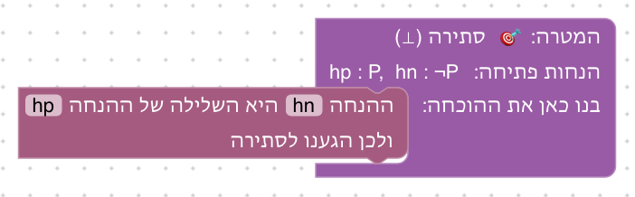

**שיקולים ושאלות להכרעה.**
- הסדר בבלוק: קודם השלילה ואחר כך הטענה ("ההנחה hn היא השלילה של ההנחה hp"). סטודנט שממלא אותם הפוך מקבל הסבר. האם עדיף שהבלוק יקבל את שתי ההנחות בכל סדר?
- סתירה מוצגת כ"סתירה (⊥)". האם להשתמש בסימן ⊥ בכלל, או רק במילה, בהתאם למוסכמות הקורס?

### שלב 3.2: עיקרון הסתירה

`hp : P, hn : ¬P ⊢ ⊥` · בארגז: עיקרון הסתירה, צירוף ל"וגם", הוכחת "וגם", מעבר לתנאי, הסקה קדימה, זה בדיוק

**מה לומדים.** את עיקרון הסתירה כטענה מפורשת, `(P ∧ ¬P) → ⊥`, שמשתמשים בה כמו בכל גרירה. בדרך קדימה משתמשים שוב בצירוף ל"וגם" משלב 2.3.

**למה כך.** אותן הנחות ואותה מטרה כמו בשלב 3.1, אבל הפעם הסתירה מגיעה מעיקרון כללי ולא מבלוק ייעודי. כך הבלוק של 3.1 מתגלה כקיצור של עיקרון לוגי. השלב משלב מושגים מיחידות 1 ו־2 (גרירה ו"וגם"), ומאפשר את שני הכיוונים.

**פתרון א: אחורה.** המסקנה של העיקרון היא ⊥; מוכיחים את התנאי שלו בשני חלקים.

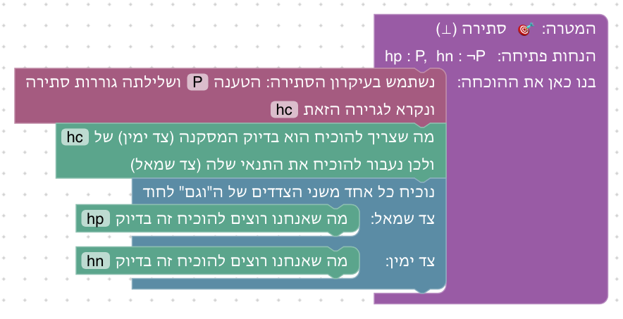

**פתרון ב: קדימה.** מצרפים את hp ו־hn, ומהעיקרון מסיקים סתירה.

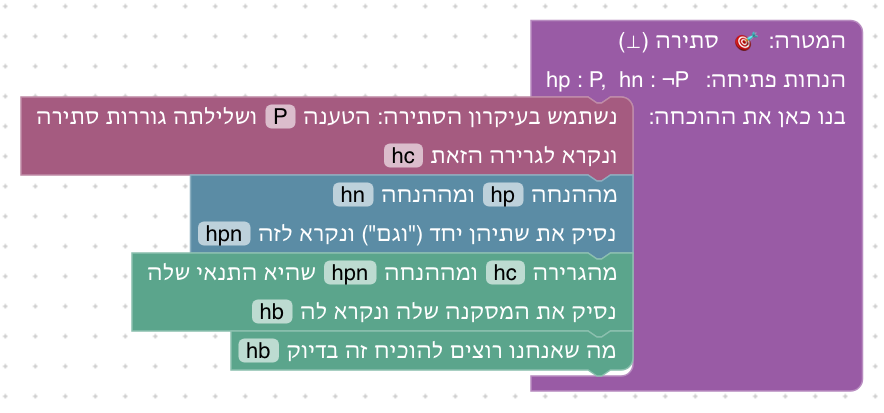

**שיקולים ושאלות להכרעה.**
- האם השלב מיותר אחרי 3.1? הוא מלמד שהסתירה היא עיקרון ולא "מהלך קסם", אבל מאריך את היחידה. חלופה: להציג את העיקרון רק בטקסט של 3.1.
- הבלוק "צירוף ל'וגם'" מוצג כבר ביחידה 2 (שלב 2.3), ונמצא גם בשלבים 2.8, 2.9 ו־3.9: בכל מקום שיש בו שני חלקים להצמיד, ובלי לעקוף את הלקח של השלב (לכן לא בשלב 2.2).

### שלב 3.3: מסתירה נובע הכול

`hp : P, hn : ¬P ⊢ Q` · בארגז: סתירה גוררת, מעבר לתנאי, הסקה קדימה, סתירה, זה בדיוק

**מה לומדים.** מסתירה נובעת כל טענה (ex falso), כגרירה `⊥ → Q` שנכונה תמיד. ו־¬P היא גם גרירה, P → ⊥.

**למה כך.** במקום מהלך שמחליף את המטרה בסתירה (`exfalso`), הבלוק מוסיף את הגרירה ⊥ → Q, ואז משתמשים במהלך המוכר מיחידה 1. כך עיקרון חדש מוצג כטענה לוגית, והמהלך שמשתמש בו כבר מוכר. הבלוק "הגענו לסתירה" לבדו לא מספיק כאן, כי הוא סוגר רק מטרה שהיא סתירה, וזו בדיוק ההבחנה שהשלב מלמד.

**פתרון א: אחורה.** סתירה גוררת Q; עוברים להוכיח סתירה.

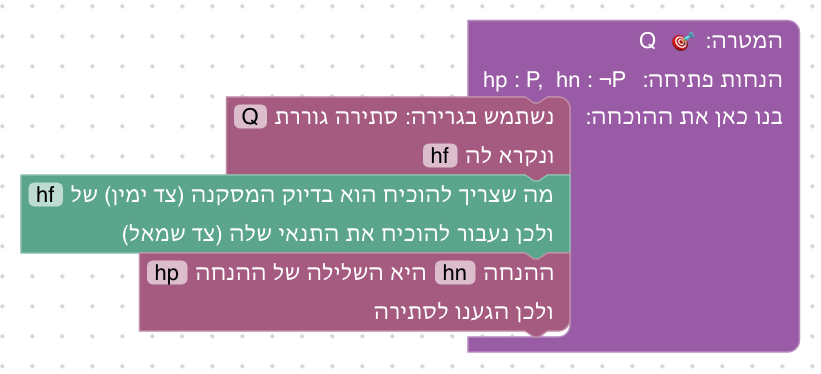

**פתרון ב: קדימה.** מ־hn ו־hp נובעת סתירה, וממנה ומ־hf נובע Q.

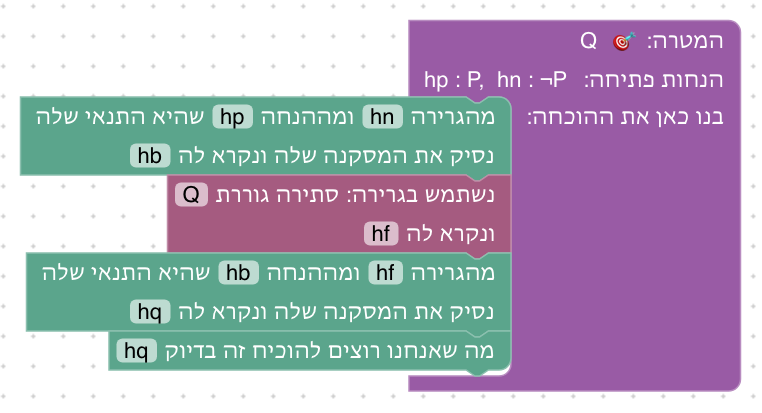

**שיקולים ושאלות להכרעה.**
- סטודנטים רבים מוצאים את ex falso מוזר ("למה מסתירה נובע הכול?"). הטקסט מסביר במשפט אחד. האם צריך הסבר ארוך יותר, למשל דרך טבלת האמת של גרירה?
- הסטודנט מקליד את Q בבלוק "סתירה גוררת". אם יקליד טענה אחרת, ההסבר יגיד שהמסקנה לא זהה למטרה. האם זה מספיק ברור?

### שלב 3.4: מוכיחים שלילה

`hp : P ⊢ ¬¬P` · בארגז: הוכחת שלילה, סתירה, הסקה קדימה, זה בדיוק

**מה לומדים.** להוכיח שלילה (¬I): מניחים את הטענה שהיא שוללת, ומגיעים לסתירה.

**למה כך.** ¬¬P היא שלילה של ¬P, ולכן מניחים את ¬P; הסתירה עם hp מיידית. כך הרעיון החדש היחיד הוא הוכחת השלילה. השלב הזה הוא גם חצי מזוג (forall x): כאן P → ¬¬P, ובשלב 3.7 הכיוון ההפוך.

**פתרון א.** מניחים ¬P ומגיעים לסתירה עם hp.

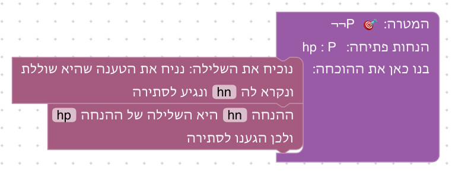

**פתרון ב: קדימה.** ¬P היא P → ⊥, ולכן מ־hn ו־hp נובעת סתירה.

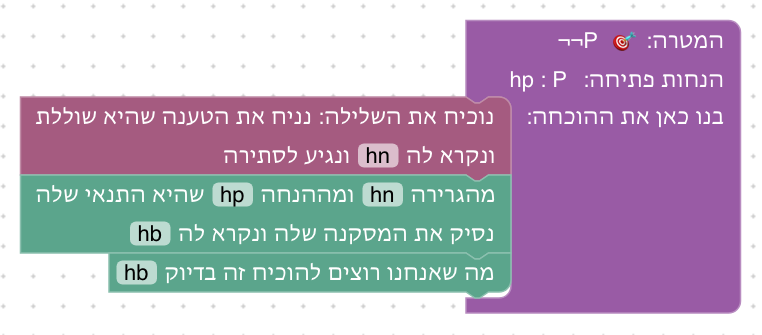

**שיקולים ושאלות להכרעה.**
- שלילה כפולה מבלבלת סטודנטים רבים. האם עדיף להתחיל בהוכחת שלילה פשוטה יותר, למשל `P → Q, ¬Q ⊢ ¬P` (שלב 3.5), ורק אחר כך ¬¬P?

### שלב 3.5: משתמשים בשלילה

`h : P → Q, hnq : ¬Q ⊢ ¬P` · בארגז: הוכחת שלילה, שימוש בשלילה, מעבר לתנאי, הסקה קדימה, סתירה, זה בדיוק

**מה לומדים.** להשתמש בשלילה: כשהמטרה היא סתירה ויש בידינו ¬Q, מספיק להוכיח את Q. בלוגיקה זה modus tollens.

**למה כך.** סטודנטים נתקעים כשהמטרה היא סתירה ואין בידם P ו־¬P מוכנים (Verbose Lean, HTPI). הבלוק "שימוש בשלילה" עונה על השאלה "מה עושים עכשיו?": בוחרים שלילה ומוכיחים את מה שהיא שוללת, כמו `contradict` ב־HTPI.

**פתרון א: אחורה.** מגיעים לסתירה בעזרת ¬Q: מוכיחים את Q.

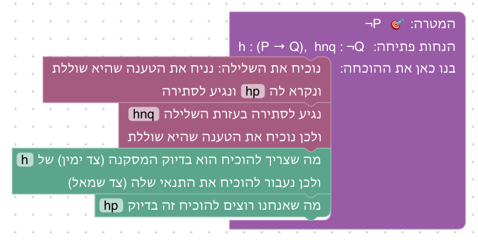

**פתרון ב: קדימה.** מ־h ו־hp נובע Q, ו־hnq היא השלילה שלה: סתירה. זו הדרך הישירה ביותר, וכך גם מוכיחים modus tollens בכתב: "מ־P נובע Q, אבל נתון ¬Q, סתירה".

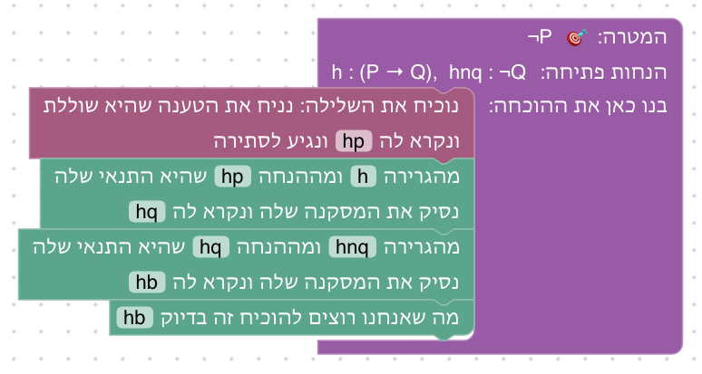

**שיקולים ושאלות להכרעה.**
- בפתרון קדימה הבלוק החדש, "שימוש בשלילה", כלל לא נחוץ. הוחלט שזה בסדר: הוא נשאר הפתרון אחורה, ובשלבים 3.6, 3.9 ו־3.10 הוא הכרחי, כי שם השלילה היא של טענה שאין דרך להגיע אליה קדימה (למשל ¬(P ∨ Q)), כך שהסטודנטים יתרגלו אותו ממילא. האם זה מספיק, או שצריך בשלב 3.5 עצמו לחייב את השימוש בו?

### שלב 3.6: שלילה של "או"

`⊢ ¬(P ∨ Q) → (¬P ∧ ¬Q)` · בארגז: נניח, הוכחת "וגם", הוכחת שלילה, שימוש בשלילה, צד שמאל, צד ימין, הסקה קדימה, זה בדיוק

**מה לומדים.** חוק דה מורגן הראשון, וגם לשלב כללים משתי היחידות.

**למה כך.** הסטודנטים מוכיחים את חוקי דה מורגן בעצמם, במקום שבלוק "דחיפת שלילה" (`push_neg`) יעשה זאת: בקורס לוגיקה החוקים הם חומר הלימוד. הכיוון הזה נבחר ראשון כי הוא קל יותר: אין בו בדיקת שתי אפשרויות.

**פתרון.** בכל חלק מוכיחים שלילה, ומגיעים לסתירה בעזרת h.

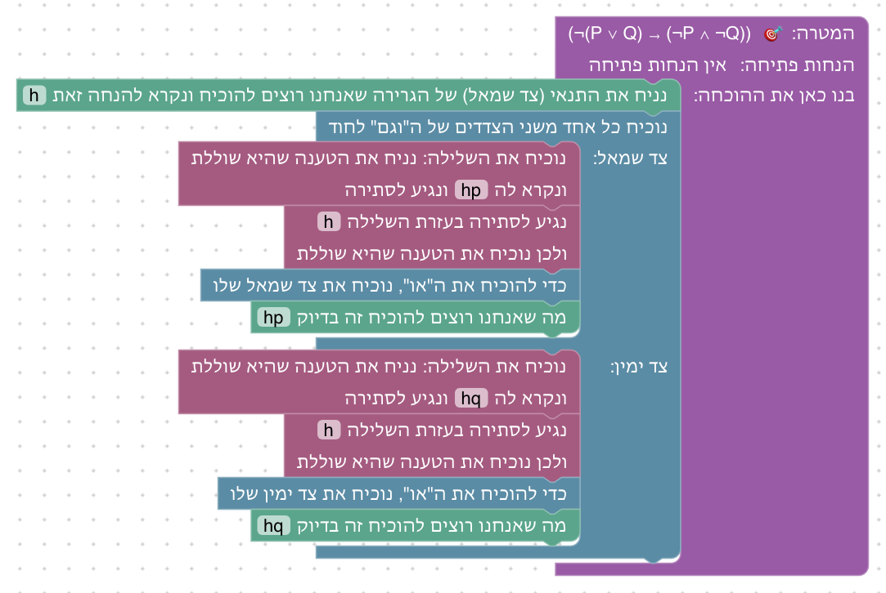

**שיקולים ושאלות להכרעה.**
- כדאי להוסיף את הכיוון ההפוך (`(¬P ∧ ¬Q) → ¬(P ∨ Q)`), שגם הוא קונסטרוקטיבי, ולקבל שקילות מלאה?
- Massot ממליץ להחליף טאוטולוגיות בגרסת קבוצות: `x ∉ A ∪ B ↔ x ∉ A ∧ x ∉ B`. כאן, או ביחידה 5?

### שלב 3.7: הוכחה בשלילה

`⊢ ¬¬P → P` · בארגז: נניח, הוכחת שלילה, הוכחה בשלילה, סתירה

**מה לומדים.** הוכחה בשלילה: כדי להוכיח P מניחים ¬P ומגיעים לסתירה. וההבדל בינה לבין הוכחת שלילה.

**למה כך.** הבלבול הנפוץ ביותר ביחידה הוא בין הוכחת ¬P (מניחים P) לבין הוכחה בשלילה של P (מניחים ¬P); forall x מבחין ביניהן (¬I מול IP), ו־Verbose Lean מזהיר מפני הבלבול. הטקסט פותח בהשוואה לשלב 3.4, שבו הוכח הכיוון ההפוך. בארגז יש גם את הבלוק של הוכחת שלילה, כדי שהסטודנט יצטרך לבחור ביניהם: המטרה P אינה שלילה, ולכן רק הוכחה בשלילה מתאימה.

**פתרון.** מניחים בשלילה ¬P; h היא השלילה שלה.

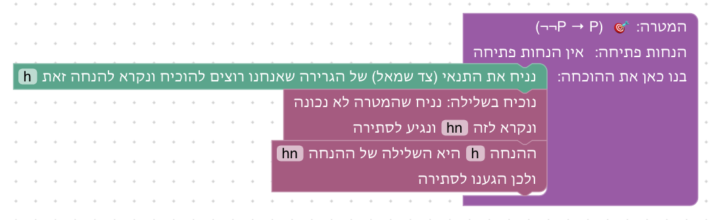

**שיקולים ושאלות להכרעה.**
- כרגע הבלוק "הוכחה בשלילה" מתקבל גם כשהמטרה היא שלילה (זה תקף, אבל מיותר). Verbose Lean מסרב ומסביר. האם לסרב גם כאן?
- ~~האם להסביר למה העיקרון הוא "קלאסי", כלומר שיש לוגיקות שאינן מקבלות אותו, או שזה מעבר להיקף הקורס?~~ **הוחלט (2026-10-05):** לא מסבירים, ולא מבחינים בין הכלים (ראו סדר היחידה).

### שלב 3.8: שתי אפשרויות

`hpq : P → Q, hnpq : ¬P → Q ⊢ Q` · בארגז: שתי אפשרויות, מעבר לתנאי, הסקה קדימה, זה בדיוק

**מה לומדים.** חוק השלישי מן הנמנע כחלוקה למקרים: כל טענה נכונה או לא נכונה, ולכן אפשר לבדוק את שתי האפשרויות.

**למה כך.** forall x מציג את חוק השלישי מן הנמנע בדיוק בצורה הזאת: מ־A וגם מ־¬A נובע B, ולכן B. כך הוא נראה כמו חלוקה למקרים מיחידה 2, ולא כמו טענה מופשטת `P ∨ ¬P`. מבנה השלב זהה לשלב 2.5.

**פתרון א: אחורה.** בכל אפשרות, המסקנה של הגרירה המתאימה היא Q.

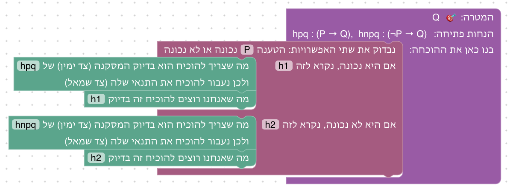

**פתרון ב: קדימה.** בכל אפשרות, ההנחה החדשה היא התנאי של אחת הגרירות.

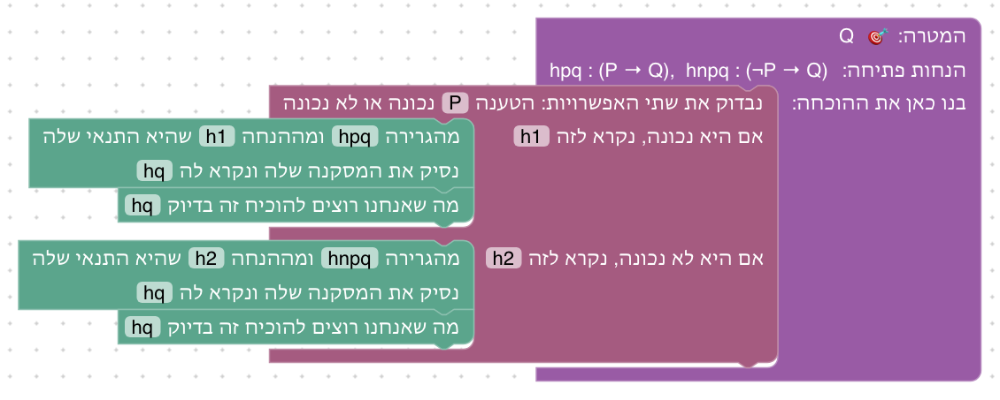

**שיקולים ושאלות להכרעה.**
- הסטודנט מקליד את הנוסחה (P) בבלוק. נוסחה שגויה, או משתנה שאינו בשלב, מקבלים הסבר כללי. האם להגביל לבחירה מתוך רשימה של תת־נוסחאות?

### שלב 3.9: תרגיל מסכם: שלילה של "וגם"

`⊢ ¬(P ∧ Q) → (¬P ∨ ¬Q)` · בארגז: נניח, שתי אפשרויות, צד שמאל, צד ימין, הוכחת שלילה, שימוש בשלילה, הוכחת "וגם", צירוף ל"וגם", הסקה קדימה, זה בדיוק

**מה לומדים.** חוק דה מורגן השני, ושוב את הלקח של שלב 2.6: לא בוחרים צד של "או" מוקדם מדי.

**למה כך.** זה התרגיל המסכם של היחידה: הוא משלב שלילה, חלוקה למקרים ו"או", והטקסט מזכיר במפורש את הטעות משלב 2.6.

**פתרון א: אחורה.** שתי אפשרויות לגבי P, ובכל אחת בוחרים צד; הסתירה בעזרת h, דרך הוכחת P ∧ Q.

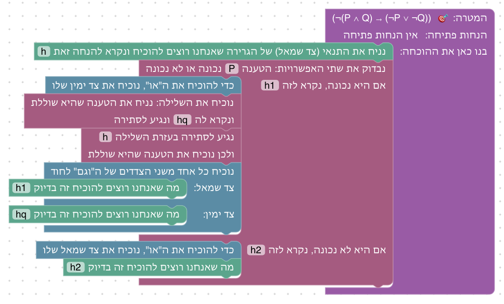

**פתרון ב: קדימה.** במקרה ש־P נכונה, מצרפים את h1 ו־hq ל־P ∧ Q, ומ־h ומהצירוף נובעת סתירה.

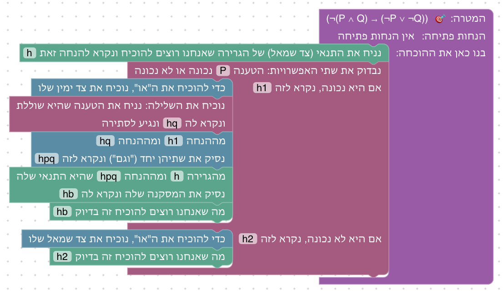

**שיקולים ושאלות להכרעה.**
- זו הוכחה ארוכה (עשרה בלוקים, בשתי רמות קינון). האם היא מתאימה כתרגיל חובה, או שעדיף להפוך אותה לבונוס ולהציב במקומה תרגיל קצר יותר?

### שלב 3.10: שלב בונוס: שלילה של גרירה

`⊢ ¬(P → Q) → ¬¬P` · בארגז: נניח, הוכחת שלילה, שימוש בשלילה, סתירה גוררת, מעבר לתנאי, סתירה

**מה לומדים.** לשלב בהוכחה אחת את הכללים של שלבים 3.1–3.5.

**למה כך.** זה שלב ה"בוס" של עולם השלילה ב־Logic Game. הוא מחייב גם ex falso בתוך הוכחה (כדי להוכיח Q מסתירה), כך שכל כלי היחידה נכנסים לשימוש. הסיבה שהטענה נכונה מוסברת בטקסט: אם P לא הייתה נכונה, הגרירה הייתה נכונה.

**פתרון.** מוכיחים ¬¬P; הסתירה מגיעה מ־h, ו־Q נובעת מהסתירה בין hp ל־hnp.

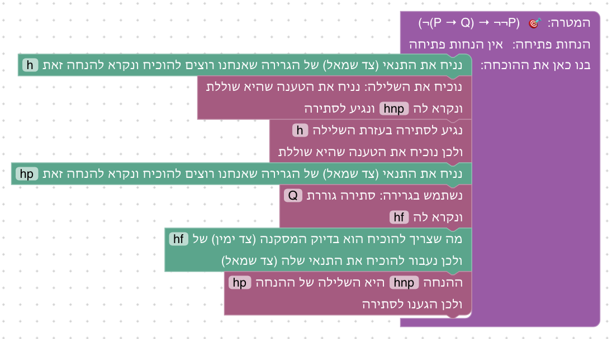

**שיקולים ושאלות להכרעה.**
- בארגז אין "זה בדיוק" ולכן גם לא הסקה קדימה, ויש רק פתרון אחד. האם להוסיף אותם כדי לאפשר פתרון קדימה?
- הבונוס של יחידה 2 הוא טענה שימושית (פילוג); זה הוא חידה. האם בונוס צריך להיות טענה שימושית, כמו קונטרפוזיציה `(¬Q → ¬P) → (P → Q)`, שאפשרית עכשיו בעזרת ההסקה קדימה?

## רקע: מה עושים מדריכים אחרים

המשך הסקירה של [יחידה 2](02-and-or-iff.md#רקע-מה-עושים-מדריכים-אחרים), על שלילה:
- **סדר:** כמעט בכל המקורות החלק הקונסטרוקטיבי בא קודם, והחלק הקלאסי אחריו:
  1. ¬E, טענה ושלילתה הן סתירה
  2. ¬I, הוכחת שלילה
  3. ex falso, מסתירה נובע הכול
  4. `P → ¬¬P`, modus tollens, ודה מורגן בכיוון הקל

  אחריהם: הוכחה בשלילה, חוק השלישי מן הנמנע, `¬¬P → P`, ודה מורגן השני. forall x ו־Logic and Proof מסמנים במפורש את החלק הקלאסי; כאן ויתרנו על הסימון (ראו סדר היחידה).
- **הבלבול הנפוץ:** הוכחת ¬P מול הוכחה בשלילה. Verbose Lean מזהיר: "המטרה היא שלילה, אין טעם להוכיח אותה בשלילה". forall x מבחין בין ¬I לבין IP (indirect proof). לכן שלב 3.6 נפתח בהשוואה לשלב 3.3.
- **"מה עושים כשהמטרה היא סתירה?"** התשובה של Verbose Lean ו־HTPI: לוקחים שלילה מההנחות ומוכיחים את מה שהיא שוללת. מזה נולד הבלוק "שימוש בשלילה" (כמו `contradict` ב־HTPI).
- **בחירת שלבים:** Logic Game (עולם NotIntro: `P ⊢ ¬¬P`, modus tollens, הבונוס `¬(B→C) ⊢ ¬¬B`), סדרת הדה מורגן של D∃∀duction, ו־forall x (הזוג `D ⊢ ¬¬D` מול `¬¬D ⊢ D`).

## שאלות כלליות להכרעה

- **קונטרפוזיציה כמהלך:** בלוק "נוכיח את הגרירה ההפוכה לשלילות" (`P → Q` ⟶ `¬Q → ¬P`) אפשרי בלי Mathlib, בעזרת למה קטנה (נבדק). לא נכלל ביחידה כדי שהסטודנטים יוכיחו קודם את שני הכיוונים בעצמם. האם להוסיף אותו כאן, או ביחידת הכמתים, שבה הוא שימושי יותר?
- **גרסת קבוצות:** כמו ביחידה 2, אולי כדאי להוסיף גם `x ∉ A ∪ B ↔ x ∉ A ∧ x ∉ B`, ביחידה 5.

