# יחידה 4 — כמתים

**מטרה:** שימוש בכמתים "לכל" ו"קיים" והוכחה שלהם. הסטודנט לוקח עצם שרירותי כדי להוכיח "לכל", מציב עצם בטענת "לכל", בוחר עד כדי להוכיח "קיים", ומקבל עצם מהנחת "קיים". הוא מבין שסדר המהלכים חשוב (מקבלים עצם לפני שבוחרים אותו כעד), שסדר הכמתים חשוב, ואיך שלילה עוברת דרך כמתים.

## הבלוקים

| כלל | כיתוב הבלוק | Lean | לפני → אחרי |
|---|---|---|---|
| הוכחת "לכל" (∀I) | כדי להוכיח "לכל": יהי x עצם שרירותי | `refine easylean_forall_intro (fun x => ?_)` | `⊢ ∀x P(x)` ⟶ `x : α ⊢ P(x)` |
| שימוש ב"לכל" (∀E) | נציב את העצם a בהנחה h מסוג "לכל", ונקרא לתוצאה ha | `have ha := easylean_forall_elim h a` | `h : ∀x P(x)` ⟶ גם `ha : P(a)` |
| הוכחת "קיים" (∃I) | כדי להוכיח "קיים": נבחר את העצם a ונוכיח שהוא מתאים | `apply Exists.intro a` | `⊢ ∃x P(x)` ⟶ `⊢ P(a)` |
| שימוש ב"קיים" (∃E) | מההנחה h מסוג "קיים" נקבל עצם x שמקיים אותה, ונקרא לזה hx | `refine Exists.elim h (fun x hx => ?_)` | `h : ∃x P(x)` ⟶ גם `x : α`, `hx : P(x)` |

**תחום מופשט עם משמעות.** הטענות מדברות על תחום מופשט α ועל תכונות P, Q, R (כמו HTPI ו־Logic and Proof), וכל טקסט פתיחה נותן להן משמעות לדוגמה ("התחום: הסטודנטים בקורס; P(x): x עבר את הבוחן"). כך נמנעים מטאוטולוגיות ריקות (אזהרת Massot), בלי צורך באריתמטיקה וב־Mathlib.

**סימון הקורס.** Lean כותב `∀ (x : α), P x → Q x`; התצוגה ממירה ל־`∀x (P(x) → Q(x))`: סוגריים סביב ארגומנטים, בלי טיפוס התחום. כמת מתפרש עד סוף הנוסחה, ונוסחה עם כמת בתוך קשר מוקפת בסוגריים (`(∀x P(x)) → Q`), כדי שיהיה ברור היכן הוא נגמר. בחלונית מצב ההוכחה לא מוצגות ההכרזות על אוצר המילים של השלב (`P Q : Prop`, `α : Type`), כי הן אינן הנחות; עצמים מהתחום (`x : α`) כן מוצגים.

**הפרדה חמורה בין "לכל" לגרירה.** ב־Lean ‏∀ וגרירה הם אותו מבנה (גרירה היא ∀ על הוכחות), ולכן `intro` והפעלת הנחה מקבלים את שניהם. למות קטנות שמוצבות לפני כל הוכחה (`LEAN_PRELUDE` ב־`frontend/src/generator/lean.js`) מבחינות ביניהם: "לכל" רץ על עצמי התחום (Type), וגרירה על טענות (Prop). לכן "נניח את התנאי" וההסקה קדימה (מיחידה 1) נכשלים על "לכל", ו"יהי x עצם שרירותי" והצבה ב"לכל" נכשלים על גרירה, וכל כישלון מקבל הסבר בעברית (עיקרון 2 ב[עקרונות העיצוב](design/principles.md): בלוק אחד לכל אסטרטגיה). ההפרדה לא מאטה את הבדיקה; הדרך הכללית (`import Lean`) הייתה מאטה כל בדיקה מ־0.14 ל־3.1 שניות. שלילה לא מושפעת: ¬R היא הגרירה R → ⊥.

## שלבים

לכל שלב: מה לומדים בו, למה הוא בנוי כך, איך אנחנו רוצים שסטודנטים יפתרו אותו, ושיקולים ושאלות שעוד צריך להכריע. צילומי הפתרונות נוצרים מ־`frontend/e2e/solutions.js` (ראו [יחידה 0](00-getting-started.md#שלבים)).

**סדר היחידה.** קודם "לכל" (4.1–4.4), ואחריו "קיים" (4.5–4.7), כמו ברוב המקורות. בכל כמת קודם השימוש ואחר כך ההוכחה, כמו ב־HTPI וב־D∃∀duction; forall x מקדים את הכללים הקלים (∀E, ∃I) לכללים עם התנאים (∀I, ∃E), וזה מתיישב עם הסדר הזה. אחר כך שלילת כמתים (4.8), סדר הכמתים (4.9), ובונוס קלאסי (4.10).

### שלב 4.1: משתמשים בהנחה מסוג "לכל"

`a : α, h : ∀x P(x) ⊢ P(a)` · בארגז: שימוש ב"לכל", הסקה קדימה, זה בדיוק

**מה לומדים.** מה זה תחום, תכונה ו"לכל", ואת השימוש ב"לכל": מציבים עצם.

**למה כך.** השלב מציג את כל המושגים החדשים של היחידה (עצם, תחום, תכונה, כמת) עם המהלך הפשוט ביותר. העצם a נתון, כדי שתהיה הצבה אפשרית מיד.

**פתרון.** מציבים את a בהנחה h.

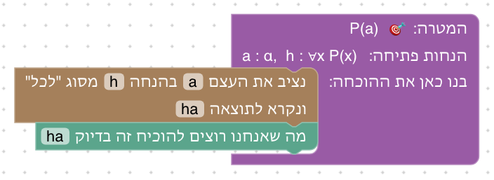

**שיקולים ושאלות להכרעה.**
- העצם a מוצג כ־`a : α`. האם הסימון α ברור לסטודנטים, או שעדיף לכתוב את התחום במילים ("a הוא סטודנט")?

### שלב 4.2: "לכל" וגרירה

`a : α, h : ∀x (P(x) → Q(x)), hp : P(a) ⊢ Q(a)` · בארגז: שימוש ב"לכל", מעבר לתנאי, הסקה קדימה, זה בדיוק

**מה לומדים.** שהצבה ב"לכל" נותנת טענה רגילה, כאן גרירה על a, שמשתמשים בה בכלים של יחידה 1.

**למה כך.** זה הדפוס הנפוץ ביותר בהוכחות עם "לכל" ("כל מי ש... הוא..."), והוא מחבר את היחידה לקודמות. שתי הדרכים של יחידה 1 פתוחות.

**פתרון א: קדימה.** מציבים את a, ומהגרירה ומ־hp מסיקים את Q(a).

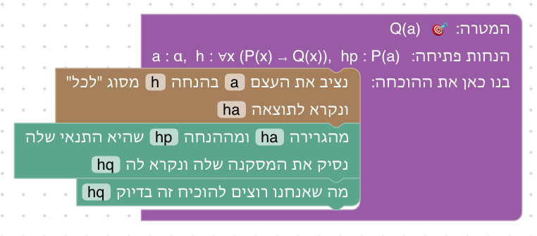

**פתרון ב: אחורה.** מציבים את a; המסקנה של הגרירה היא המטרה.

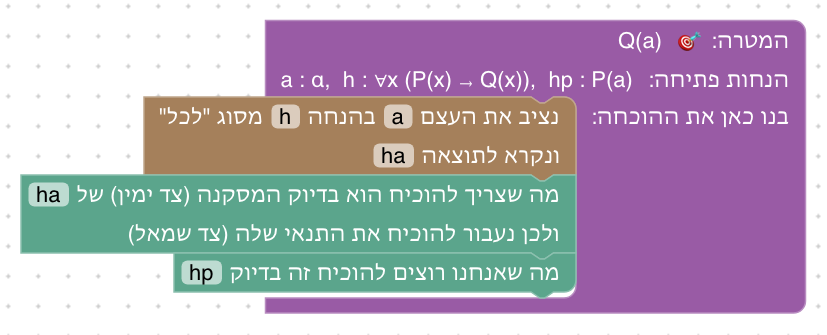

**שיקולים ושאלות להכרעה.**
- Verbose Lean מאפשר "להחיל את h על a" ישירות, בלי לשמור את התוצאה כהנחה. כאן ההצבה תמיד יוצרת הנחה חדשה. האם זה מאריך מדי?

### שלב 4.3: מוכיחים טענה מסוג "לכל"

`⊢ (∀x (P(x) ∧ Q(x))) → (∀x P(x))` · בארגז: נניח, יהי עצם שרירותי, שימוש ב"לכל", שימוש ב"וגם", הסקה קדימה, זה בדיוק

**מה לומדים.** להוכיח "לכל" בעזרת עצם שרירותי, ושההצבה אפשרית רק אחרי שיש עצם.

**למה כך.** הרעיון של עצם שרירותי הוא המושג הקשה ביחידה: x לא נבחר בשום אופן מיוחד, ולכן מה שהוכח עליו נכון לכל עצם. טקסט הסיום מדגיש את סדר המהלכים: קודם לוקחים את x, ורק אז מציבים אותו (ההערה של HTPI: אי אפשר להשתמש ב"לכל" כשאין עוד אף עצם).

**פתרון.** עצם שרירותי x, הצבה בהנחה, ושימוש ב"וגם".

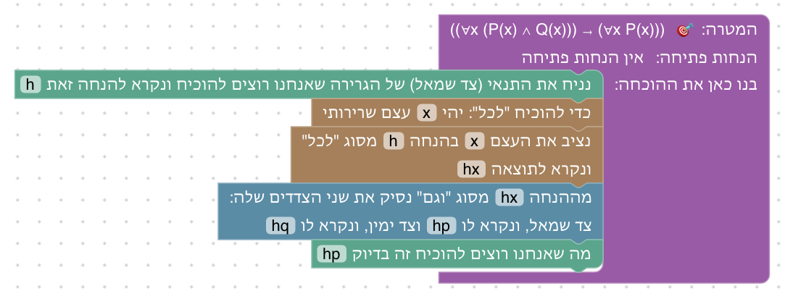

**שיקולים ושאלות להכרעה.**
- התנאי על עצם שרירותי (שאסור שיופיע בהנחות קודמות; forall x ו־Logic and Proof מנסחים אותו במפורש) לא נאכף כאן, כי הבלוק תמיד יוצר עצם חדש. אם הסטודנט נותן לו שם של עצם קיים, הישן מוסתר. האם להזהיר, כמו Verbose Lean ("The name is already used")?
- נשקלה פתיחה עם הצבה לפני שיש עצם (טעות מוכנה); לא נבחרה, כי לבלוק כזה אין עצם להצביע עליו, והשגיאה הייתה פחות ברורה.

### שלב 4.4: "לכל" וגרירה, בשני הצדדים

`⊢ (∀x (P(x) → Q(x))) → ((∀x P(x)) → (∀x Q(x)))` · בארגז: נניח, יהי עצם שרירותי, שימוש ב"לכל", מעבר לתנאי, הסקה קדימה, זה בדיוק

**מה לומדים.** לשלב הוכחת "לכל" עם שימוש בשתי טענות "לכל": מציבים את אותו עצם שרירותי בשתיהן.

**למה כך.** ש"לכל" מתפלג על גרירה הוא תרגיל ראשון ב־Logic and Proof. הוא מחייב להבין שהעצם השרירותי הוא עצם לכל דבר, שאפשר להציב בכל טענת "לכל".

**פתרון א: קדימה.** אותו עצם שרירותי מוצב בשתי ההנחות.

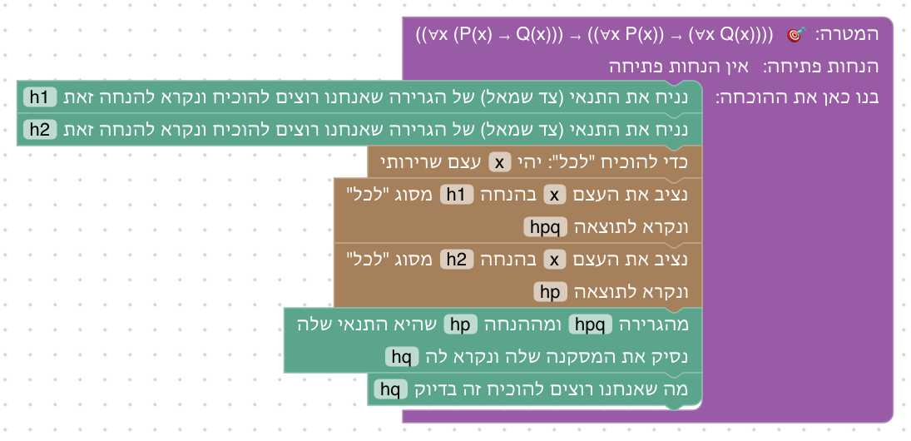

**פתרון ב: אחורה.** המסקנה של הגרירה על x היא המטרה.

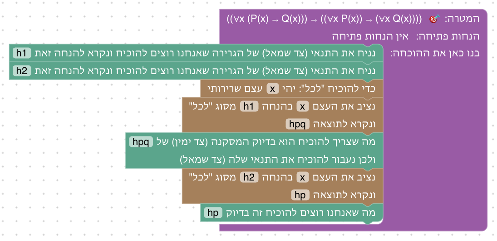

**שיקולים ושאלות להכרעה.**
- האם להוסיף שלב שבו הצבה של עצם *לא* שרירותי נכשלת (למשל ∀x R(x,k) לא גוררת ∀x R(x,x)), כמו הדוגמאות השגויות ב־forall x?

### שלב 4.5: מוכיחים טענה מסוג "קיים"

`a : α, hp : P(a) ⊢ ∃x (P(x) ∨ Q(x))` · בארגז: הוכחת "קיים", צד שמאל, צד ימין, הסקה קדימה, זה בדיוק

**מה לומדים.** להוכיח "קיים": בוחרים עד, ומוכיחים שהוא מתאים.

**למה כך.** העד נתון (a), כדי שהבחירה תהיה ברורה. אחרי הבחירה נשארת מטרה מסוג "או" מיחידה 2, כדי להראות שבחירת עד היא רק הצעד הראשון.

**פתרון.** a הוא עד, ובוחרים את הצד שאפשר להוכיח.

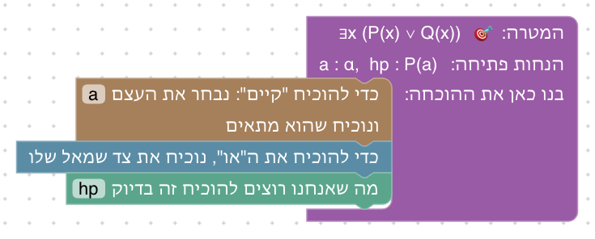

**שיקולים ושאלות להכרעה.**
- Waterproof ו־D∃∀duction מאפשרים לדחות את בחירת העד ("נבחר אחר כך"). כאן העד נבחר מיד. האם צריך מנגנון כזה בהמשך, כשהעד לא ברור מראש?

### שלב 4.6: משתמשים בהנחה מסוג "קיים"

`⊢ (∃x (P(x) ∧ Q(x))) → (∃x Q(x))` · בארגז: נניח, שימוש ב"קיים", הוכחת "קיים", שימוש ב"וגם", הסקה קדימה, זה בדיוק · השלב נפתח עם "נניח" ובחירת העד x מחוברים

**מה לומדים.** להשתמש ב"קיים": מקבלים עצם חדש, וידוע עליו רק מה שההנחה אומרת. ושאת העד בוחרים רק אחרי שמקבלים אותו.

**למה כך.** הטעות הנפוצה עם "קיים" היא לבחור עד לפני שיש אחד (HTPI ממליץ להשתמש ב"קיים" מיד; Waterproof ו־D∃∀duction נותנים לדחות את הבחירה). השלב נפתח עם הטעות הזאת כבר מחוברת: בחירת העד x כשאין עוד עצם בשם x. הבלוק אדום, וההסבר אומר שאין עצם כזה. הסטודנט מוסיף את השימוש ב"קיים" לפני הבחירה (עיקרון 7 ב[עקרונות העיצוב](design/principles.md), כמו בשלבים 0.2 ו־2.6).

**פתרון.** קודם מקבלים עצם מ"קיים", ורק אז בוחרים אותו כעד.

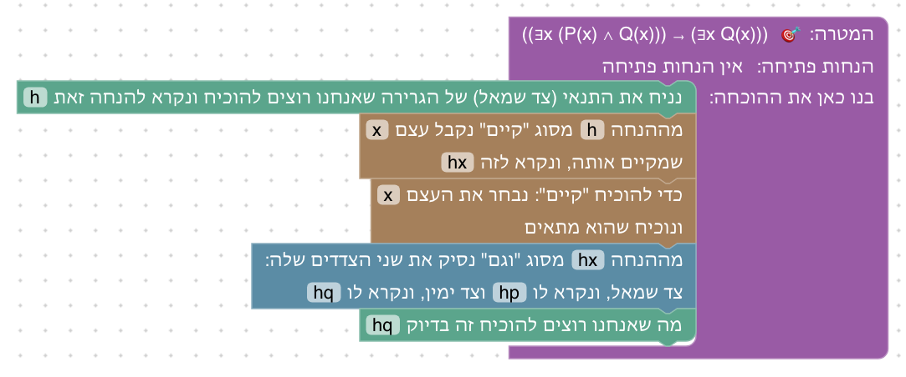

**שיקולים ושאלות להכרעה.**
- ההסבר על השגיאה הוא ההסבר הכללי לשם לא מוכר ("אין הנחה או עצם בשם x"). האם צריך הסבר ייעודי לבחירת עד לפני שיש עצם?
- Massot מבחין בין "נתון שקיים" לבין "נקבע עצם"; הבלוק מנסח זאת כ"נקבל עצם x שמקיים אותה". האם הניסוח מספיק ברור?

### שלב 4.7: "לכל" ו"קיים" יחד

`⊢ (∀x (P(x) → Q(x))) → ((∃x P(x)) → (∃x Q(x)))` · בארגז: נניח, שימוש ב"לכל", שימוש ב"קיים", הוכחת "קיים", מעבר לתנאי, הסקה קדימה, זה בדיוק

**מה לומדים.** לשלב את כל ארבעת הכללים: העצם שמתקבל מ"קיים" מוצב ב"לכל" ומשמש כעד.

**למה כך.** תרגיל מוכר מ־Logic and Proof. הוא מראה שעצם שהתקבל מ"קיים" הוא עצם לכל דבר.

**פתרון א: קדימה.** העצם מ"קיים" מוצב ב"לכל", ומשמש כעד.

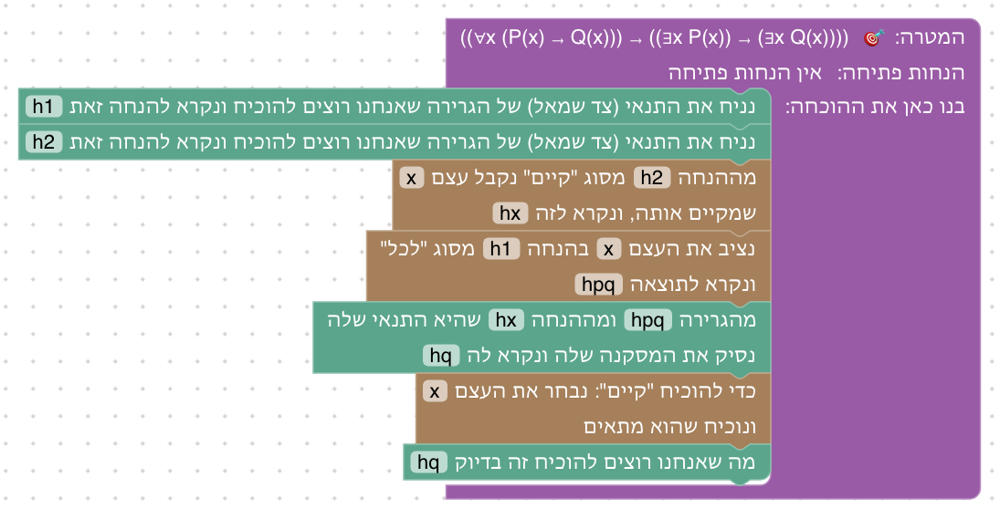

**פתרון ב: אחורה.** בוחרים את x כעד, ועוברים לתנאי של הגרירה.

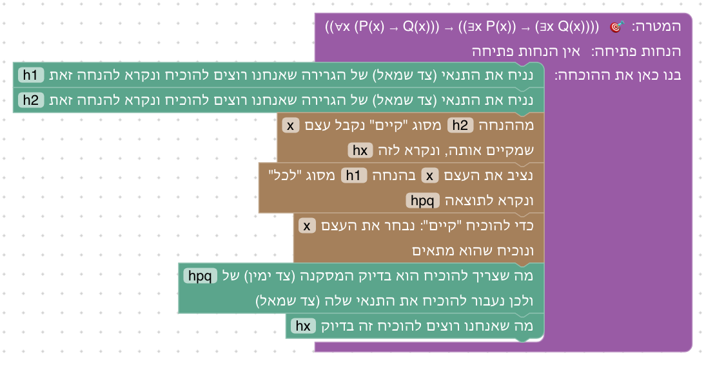

**שיקולים ושאלות להכרעה.**
- גרסת קבוצות (A ⊆ B, A ≠ ∅ ⊢ B ≠ ∅) מתאימה כאן או ביחידה 5?

### שלב 4.8: שלילה של "קיים"

`⊢ (¬∃x P(x)) → (∀x ¬P(x))` · בארגז: נניח, יהי עצם שרירותי, הוכחת שלילה, שימוש בשלילה, הוכחת "קיים", סתירה, הסקה קדימה, זה בדיוק

**מה לומדים.** שלילה עוברת דרך כמת: "אין עצם שמקיים P" פירושו "כל עצם לא מקיים P". ולשלב כמתים עם הכללים של יחידה 3.

**למה כך.** כל המקורות מלמדים שלילת כמתים אחרי ארבעת הכללים הבסיסיים. הכיוון הזה קונסטרוקטיבי, ולכן הוא בא לפני הבונוס הקלאסי. הסתירה מגיעה דרך עד ל"קיים", כך שגם "קיים" וגם "לכל" משמשים.

**פתרון.** עצם שרירותי, הוכחת שלילה, והסתירה דרך עד ל"קיים".

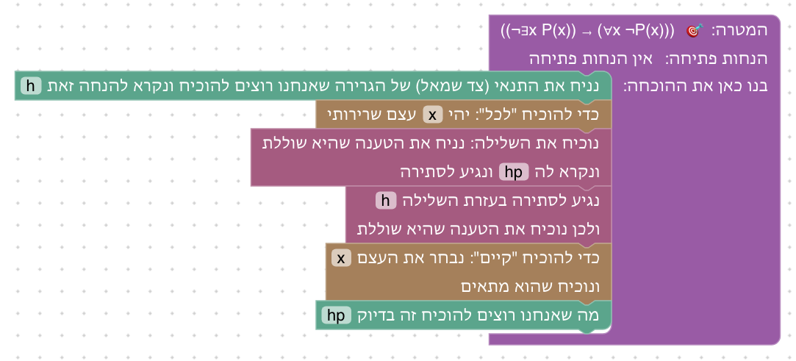

**שיקולים ושאלות להכרעה.**
- האם להוסיף את הכיוון ההפוך (∀x ¬P(x) → ¬∃x P(x)), שגם הוא קונסטרוקטיבי, ולקבל שקילות?

### שלב 4.9: תרגיל מסכם: סדר הכמתים

`⊢ (∃x ∀y R(x,y)) → (∀y ∃x R(x,y))` · בארגז: נניח, יהי עצם שרירותי, שימוש ב"לכל", שימוש ב"קיים", הוכחת "קיים", הסקה קדימה, זה בדיוק

**מה לומדים.** שסדר הכמתים חשוב: "יש מישהו שעוזר לכולם" חזק מ"לכל אחד יש מי שעוזר לו". ושוב את הלקח של 4.6.

**למה כך.** טעות נפוצה ומתועדת היא לא להבחין בין ∀∃ ל־∃∀ (Dubinsky ו־Yiparaki, לפי סיכום; המקור עצמו לא נקרא). התרגיל מופיע ב־Logic and Proof. טקסט הסיום מסביר למה הכיוון ההפוך לא נכון ("לכל אחד יש אמא" לא אומר שיש אמא של כולם), ולמה ההוכחה עובדת: העד נקבע לפני y.

**פתרון.** y שרירותי, עצם x מ"קיים", ו־x הוא העד לכל y.

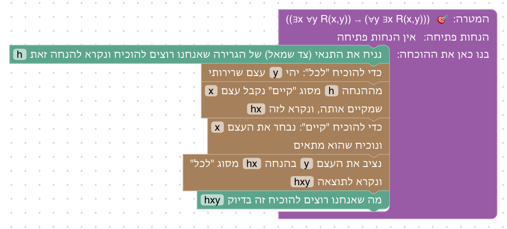

**שיקולים ושאלות להכרעה.**
- הכיוון ההפוך מוסבר רק בטקסט. האם להוסיף שלב שבו מנסים להוכיח אותו ונתקעים, כדי לראות בעצמם למה העד תלוי ב־y?
- נשקלה פתיחה עם בחירת העד מוקדם מדי (כמו 4.6); לא נבחרה, כדי שהתרגיל המסכם לא יהיה קל מדי.

### שלב 4.10: שלב בונוס: שלילה של "לכל"

`⊢ (¬∀x P(x)) → (∃x ¬P(x))` · בארגז: נניח, הוכחה בשלילה, יהי עצם שרירותי, הוכחת "קיים", הוכחת שלילה, שימוש בשלילה, סתירה, הסקה קדימה, זה בדיוק · עיקרון קלאסי

**מה לומדים.** הכיוון הקלאסי של שלילת כמתים, והוכחה בשלילה מקוננת.

**למה כך.** מבין ארבעת הכיוונים של שלילת כמתים זה היחיד שדורש עיקרון קלאסי (`Classical.not_forall` ב־Lean), ולכן הוא בונוס. מההנחה לא ידוע איזה עצם לא מקיים P, ולכן אין עד לבחור ישירות; ההוכחה בשלילה פותרת זאת.

**פתרון.** הוכחה בשלילה, ובתוכה עוד הוכחה בשלילה של P(x).

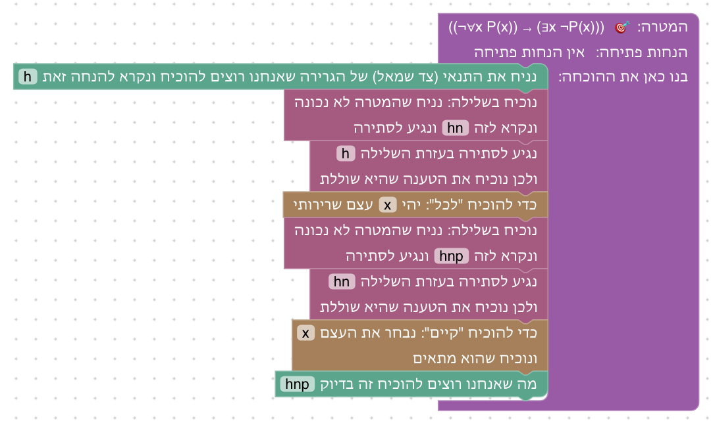

**שיקולים ושאלות להכרעה.**
- זו הוכחה עם שתי הוכחות בשלילה מקוננות. האם היא קשה מדי גם כבונוס? חלופה: לתת את הכיוון של 4.8 כטענה שהוכחה, ולהשתמש בה.

## רקע: מה עושים מדריכים אחרים

המשך הסקירה של [יחידה 2](02-and-or-iff.md#רקע-מה-עושים-מדריכים-אחרים) ו[יחידה 3](03-negation.md#רקע-מה-עושים-מדריכים-אחרים), על כמתים:
- **סדר:** רוב המקורות (HTPI, Mathematics in Lean, Logic and Proof, D∃∀duction) מלמדים "לכל" לפני "קיים"; Mechanics of Proof הפוך. forall x מקדים את הכללים הקלים (∀E, ∃I) לאלה עם התנאים (∀I, ∃E). שלילת כמתים תמיד אחרי ארבעת הכללים.
- **ניסוח:**
  - Verbose Lean: "Fix x", "By h applied to a we get", "Let's prove that a works", "By h we get x such that".
  - Waterproof: "Take x", "Use x := a in (H)", "Choose m := n", "Obtain such an n".
  - HTPI: "Let x stand for an arbitrary object", "plug in any value".
- **טעויות נפוצות:**
  - בחירת עד לפני שיש אחד, או לפני שימוש בהנחת "קיים". ממנה נולד שלב 4.6.
  - שימוש בעצם מסוים כאילו הוא שרירותי, או בשם שכבר תפוס.
  - ניסיון להשתמש ב"לכל" כשאין עוד אף עצם.
  - בלבול בסדר הכמתים. ממנו נולד שלב 4.9.
- **תחום מופשט מול מספרים:** HTPI ו־Logic and Proof מופשטים (`U : Type`, תכונות `P : U → Prop`); D∃∀duction ו־Mechanics of Proof על מספרים, שדורשים כאן Mathlib. נבחר תחום מופשט עם משמעות בטקסט.
- **מקורות:**
  - [Verbose Lean](https://github.com/PatrickMassot/verbose-lean4)
  - [Waterproof](https://github.com/impermeable/coq-waterproof)
  - [D∃∀duction](https://github.com/dEAduction/dEAduction)
  - [How To Prove It with Lean, 3.3](https://djvelleman.github.io/HTPIwL/Chap3.html)
  - [forall x, Ch. 36–38](https://forallx.openlogicproject.org/html/Ch36.html)
  - [Logic and Proof](https://leanprover-community.github.io/logic_and_proof/natural_deduction_for_first_order_logic.html)
  - [Mathematics in Lean](https://leanprover-community.github.io/mathematics_in_lean/C03_Logic.html)
  - [The Mechanics of Proof](https://hrmacbeth.github.io/math2001/04_Proofs_with_Structure_II.html)

## שאלות כלליות להכרעה

- **תחום ריק:** `∀x P(x) → ∃x P(x)` נכון רק בתחום לא ריק. לא מצאנו מקור שמסביר זאת לסטודנטים. האם להוסיף שלב בונוס שבו נתון עצם a, ולדון למה הוא נחוץ?
- **פרדוקס הספר:** ∀x (S(b,x) ↔ ¬S(x,x)) ⊢ ⊥ (Logic and Proof). חידה מוכרת ומעניינת לסטודנטים; האם להוסיף כבונוס נוסף?
- **∃ ו־∨:** `(∃x P(x)) ∨ (∃x Q(x)) ↔ ∃x (P(x) ∨ Q(x))` משלב את יחידה 2 עם כמתים. מתאים כשלב נוסף?

