# יחידה 5 — קבוצות

**מטרה:** הוכחת טענות על קבוצות: הכלה, שוויון, חיתוך, איחוד, משלים, הפרש, הקבוצה הריקה, קבוצת חזקה ומשפחות של קבוצות. הסטודנט מבין שכל פעולה על קבוצות מוגדרת דרך שייכות, ושאחרי פתיחת ההגדרה נשארת נוסחה לוגית מהיחידות הקודמות: הכלה היא "לכל", חיתוך הוא "וגם", איחוד הוא "או", משלים הוא שלילה.

## הבלוקים

| כלל | כיתוב הבלוק | Lean | לפני → אחרי |
|---|---|---|---|
| שימוש בהכלה | מההכלה h ומהשייכות hx נסיק שייכות לקבוצה הגדולה, ונקרא לזה hb | `have hb := easylean_subset_elim h hx` | `h : A ⊆ B, hx : x0 ∈ A` ⟶ גם `hb : x0 ∈ B` |
| הוכחת הכלה | כדי להוכיח הכלה: יהי x0 איבר של הקבוצה הקטנה, ונקרא לשייכות שלו hx | `refine easylean_subset_intro (fun x0 hx => ?_)` | `⊢ A ⊆ B` ⟶ `x0, hx : x0 ∈ A ⊢ x0 ∈ B` |
| שוויון קבוצות | נוכיח שוויון קבוצות בשתי הכלות; הכלה ראשונה (⊆): … הכלה שנייה (⊇): … | `apply easylean_set_eq` | `⊢ A = B` ⟶ שני חלקים: `⊢ A ⊆ B`, `⊢ B ⊆ A` |
| פתיחת הגדרה (בלוק לכל פעולה) | לפי הגדרת החיתוך / האיחוד / המשלים / ההפרש / הקבוצה הריקה / קבוצת החזקה / איחוד המשפחה / חיתוך המשפחה נפתח את [המטרה / ההנחה h] | `rewrite [easylean_mem_inter]` (או `at h`) | `x0 ∈ A ∩ B` ⟶ `x0 ∈ A ∧ x0 ∈ B` |

ההגדרות שהבלוקים פותחים:

| פעולה | הגדרה |
|---|---|
| `x ∈ A ∩ B` | `x ∈ A ∧ x ∈ B` |
| `x ∈ A ∪ B` | `x ∈ A ∨ x ∈ B` |
| `x ∈ Aᶜ` | `x ∉ A` |
| `x ∈ A \ B` | `x ∈ A ∧ x ∉ B` |
| `x ∈ ∅` | `⊥` |
| `X ∈ 𝒫(A)` | `X ⊆ A` |
| `x ∈ ⋃₀ F` | `∃S (S ∈ F ∧ x ∈ S)` |
| `x ∈ ⋂₀ F` | `∀S (S ∈ F → x ∈ S)` |

**תורת קבוצות קטנה משלנו, בלי Mathlib.** ב־Lean הבסיסי אין קבוצות. במקום Mathlib, שהייתה מאטה כל בדיקה ומגדילה את אימג' השרת בכמה GB, הוגדרה תורת קבוצות קטנה (`SET_PRELUDE` ב־`frontend/src/generator/lean.js`): קבוצה היא תכונה של עצמים, וכל פעולה מוגדרת דרך שייכות. ההקדמה נטענת רק בשלבים של היחידה הזאת (`usesSets`), והבדיקה נשארת מהירה (כ־0.22 שניות). כך גם ההגדרות גלויות: פתיחת הגדרה היא צעד לוגי מפורש.

**בלוק נפרד לכל פעולה.** הסטודנט אומר באיזו הגדרה הוא משתמש ("לפי הגדרת החיתוך"), כמו במשפט בהוכחה כתובה. בכל בלוק בוחרים אם לפתוח את המטרה או הנחה; שדה השם מופיע רק כשבוחרים הנחה. אם הפעולה לא מופיעה במקום שנבחר, ההסבר אומר זאת ("ב־x0 ∈ A אין שייכות לחיתוך").

**הכלה כמו "לכל".** שימוש בהכלה הוא כמו הסקה קדימה מגרירה, והוכחת הכלה היא כמו "יהי x0 עצם שרירותי" ביחידה 4; כך גם ב־Set Theory Game. ההכלה עצמה לא נפתחת בבלוק נפרד: הבלוקים שלה עובדים עליה ישירות.

**תצוגה.** חלונית מצב ההוכחה מציגה את הקבוצות בשורה נפרדת, "קבוצות: A, B", כמו העצמים, בלי הסימון `A : Set obj`. שני החלקים של שוויון נקראים "הכלה ראשונה (⊆)" ו"הכלה שנייה (⊇)".

## שלבים

לכל שלב: מה לומדים בו, למה הוא בנוי כך, איך אנחנו רוצים שסטודנטים יפתרו אותו, ושיקולים ושאלות שעוד צריך להכריע. צילומי הפתרונות נוצרים מ־`frontend/e2e/solutions.js` (ראו [יחידה 0](00-getting-started.md#שלבים)).

**סדר היחידה.** הכלה (5.1–5.3), חיתוך ואיחוד (5.4–5.6), שוויון (5.7–5.8), משלים והפרש (5.9–5.10), תרגיל מסכם (5.11), ואחריהם הנושאים הנוספים: הקבוצה הריקה (5.12–5.13), קבוצת חזקה (5.14), משפחות של קבוצות (5.15–5.16), ובונוס (5.17). הסדר דומה ל־Set Theory Game (הכלה, משלים, חיתוך, איחוד, שילובים, משפחות). היחידה ארוכה; היא נבנתה כולה, וכדאי לפצל או לקצר אותה לפי הניסיון.

### שלב 5.1: משתמשים בהכלה

`x0, h : A ⊆ B, hx : x0 ∈ A ⊢ x0 ∈ B` · בארגז: שימוש בהכלה, זה בדיוק

**מה לומדים.** מה זו קבוצה, שייכות והכלה, ואת השימוש בהכלה.

**למה כך.** כמו ב־Set Theory Game, השימוש בהכלה בא ראשון, והוא נראה כמו הסקה קדימה מגרירה: השייכות לקבוצה הקטנה היא התנאי. כך ההבחנה בין ∈ (שייכות של איבר) ל־⊆ (יחס בין קבוצות) מופיעה כבר בשלב הראשון.

**פתרון.** מההכלה ומהשייכות ל־A נובעת השייכות ל־B.

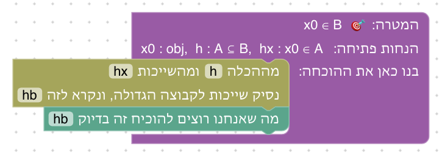

**שיקולים ושאלות להכרעה.**
- הבלבול בין ∈ ל־⊆ הוא טעות מוכרת (Mechanics of Proof). האם להוסיף שלב שבו בלבול כזה נכשל עם הסבר?

### שלב 5.2: שרשרת של הכלות

`x0, h1 : A ⊆ B, h2 : B ⊆ C, hx : x0 ∈ A ⊢ x0 ∈ C` · בארגז: שימוש בהכלה, זה בדיוק

**מה לומדים.** להשתמש בשתי הכלות ברצף.

**למה כך.** שרשרת, כמו בשלב 1.3, כדי לחזק את ההקבלה בין הכלה לגרירה.

**פתרון.** שתי הכלות ברצף.

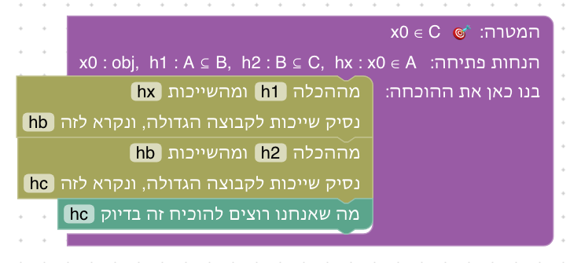

**שיקולים ושאלות להכרעה.**
- האם השלב נחוץ, או שאפשר לאחד אותו עם 5.3?

### שלב 5.3: מוכיחים הכלה

`⊢ (A ⊆ B) → ((B ⊆ C) → (A ⊆ C))` · בארגז: נניח, הוכחת הכלה, שימוש בהכלה, זה בדיוק · השלב נפתח עם שימוש בהכלה לפני שיש איבר

**מה לומדים.** להוכיח הכלה: לוקחים איבר שרירותי של הקבוצה הקטנה.

**למה כך.** אותה טעות כמו ביחידה 4: שימוש בהכלה (כמו ב"לכל") לפני שיש איבר. השלב נפתח איתה: הבלוק משתמש בשייכות hx שעוד לא קיימת, והוא אדום. הסטודנט מוסיף לפניו את לקיחת האיבר, והבלוק מתקן את עצמו (עיקרון 7).

**פתרון.** קודם איבר x0 של A, ורק אז ההכלות.

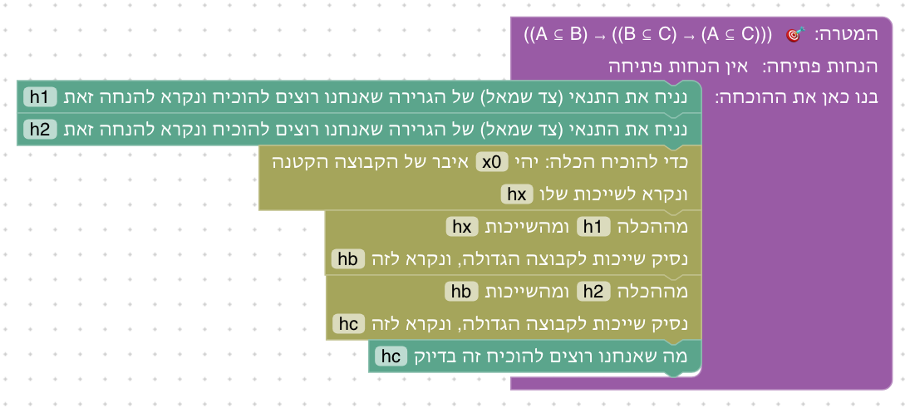

**שיקולים ושאלות להכרעה.**
- גם כאן ההסבר הוא ההסבר הכללי לשם לא מוכר ("אין הנחה או עצם בשם hx"). האם צריך הסבר ייעודי?

### שלב 5.4: חיתוך

`⊢ A ∩ B ⊆ A` · בארגז: הוכחת הכלה, הגדרת החיתוך, שימוש ב"וגם", זה בדיוק

**מה לומדים.** מה זה חיתוך, ולפתוח הגדרה בהנחה.

**למה כך.** הטענה הפשוטה ביותר על חיתוך. פתיחת ההגדרה היא צעד מפורש, כמו ההנחיה ב־Set Theory Game ("write out the meaning of intersection"): כך רואים שמתחת לחיתוך יש "וגם".

**פתרון.** פותחים את הגדרת החיתוך בהנחה, ומשתמשים ב"וגם".

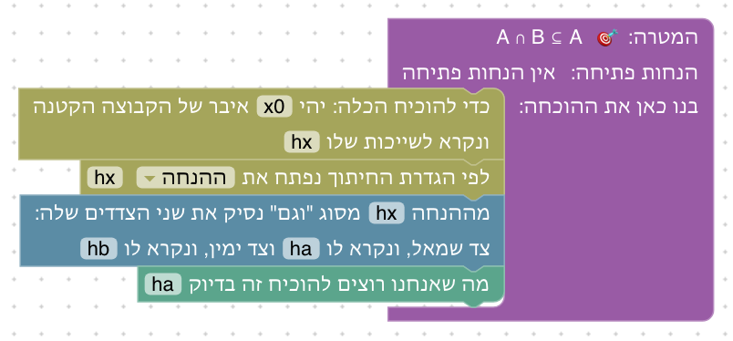

**שיקולים ושאלות להכרעה.**
- Set Theory Game מקדים שלב שבו ההנחה כבר כתובה כ"וגם" (x ∈ A ∧ x ∈ B), כדי להפריד בין "וגם" לחיתוך. האם להוסיף שלב כזה?

### שלב 5.5: שייכות לחיתוך

`h1 : A ⊆ B, h2 : A ⊆ C ⊢ A ⊆ B ∩ C` · בארגז: הוכחת הכלה, שימוש בהכלה, הגדרת החיתוך, הוכחת "וגם", צירוף ל"וגם", זה בדיוק

**מה לומדים.** לפתוח הגדרה במטרה.

**למה כך.** אותו בלוק כמו בשלב הקודם, הפעם על המטרה, כדי להראות שפתיחת הגדרה עובדת בשני המקומות.

**פתרון.** פותחים את הגדרת החיתוך במטרה, ומוכיחים כל צד בעזרת ההכלה המתאימה.

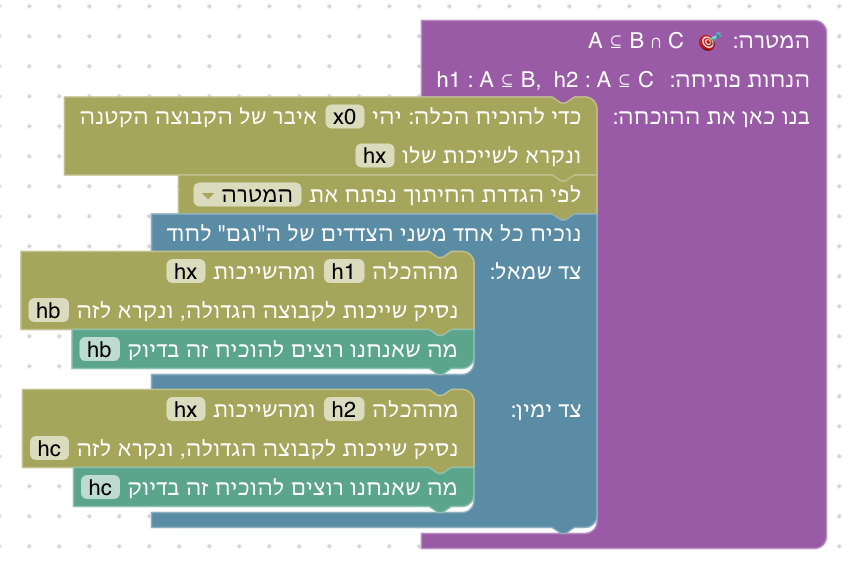

### שלב 5.6: איחוד

`h1 : A ⊆ C, h2 : B ⊆ C ⊢ A ∪ B ⊆ C` · בארגז: הוכחת הכלה, שימוש בהכלה, הגדרת האיחוד, חלוקה למקרים, זה בדיוק

**מה לומדים.** מה זה איחוד, ושהשימוש בו הוא חלוקה למקרים.

**למה כך.** התרגיל המקביל לשלב 2.5 (חלוקה למקרים), בשפת הקבוצות; Set Theory Game משתמש באותה טענה.

**פתרון.** פותחים את הגדרת האיחוד, ומחלקים למקרים.

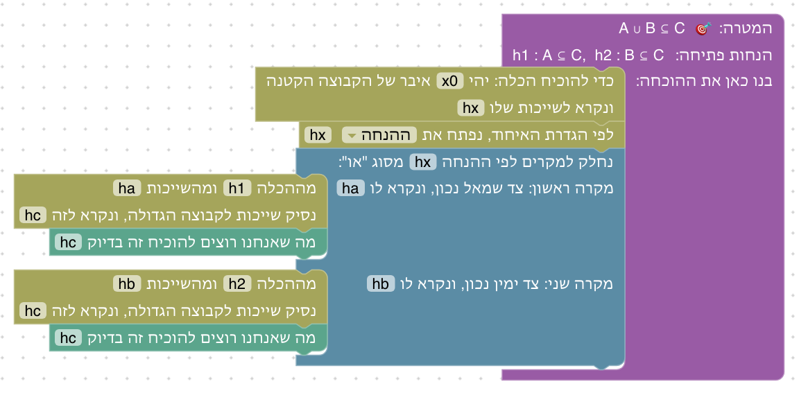

### שלב 5.7: שוויון קבוצות

`⊢ A ∩ B = B ∩ A` · בארגז: שוויון קבוצות, הוכחת הכלה, הגדרת החיתוך, שימוש ב"וגם", הוכחת "וגם", צירוף ל"וגם", זה בדיוק

**מה לומדים.** להוכיח שוויון קבוצות בשתי הכלות.

**למה כך.** הטעות הנפוצה היא להוכיח הכלה אחת בלבד; הבלוק מפצל את ההוכחה לשני חלקים, כך שאי אפשר לשכוח את השנייה. Set Theory Game משתמש באותה טענה (חילוף החיתוך).

**פתרון.** שתי הכלות; בכל אחת מחליפים את סדר הצדדים.

**שיקולים ושאלות להכרעה.**
- שתי ההכלות זהות כמעט לגמרי, והסטודנט בונה אותן פעמיים. Set Theory Game מאפשר להשתמש שוב בהכלה שהוכחה. האם להוסיף מנגנון של "טענות שהוכחו" (עלה גם בשלב 2.8)?

### שלב 5.8: פילוג

`⊢ A ∩ (B ∪ C) ⊆ (A ∩ B) ∪ (A ∩ C)` · בארגז: הוכחת הכלה, הגדרות החיתוך והאיחוד, "וגם" ו"או" (שימוש והוכחה), זה בדיוק

**מה לומדים.** שאחרי פתיחת ההגדרות נשארת הוכחה לוגית מוכרת: כאן הפילוג משלב 2.9.

**למה כך.** רק הכלה אחת, ולא השוויון כולו, כי ההוכחה ארוכה; ההכלה השנייה דומה.

**פתרון.** אחרי פתיחת ההגדרות, הוכחת הפילוג משלב 2.9.

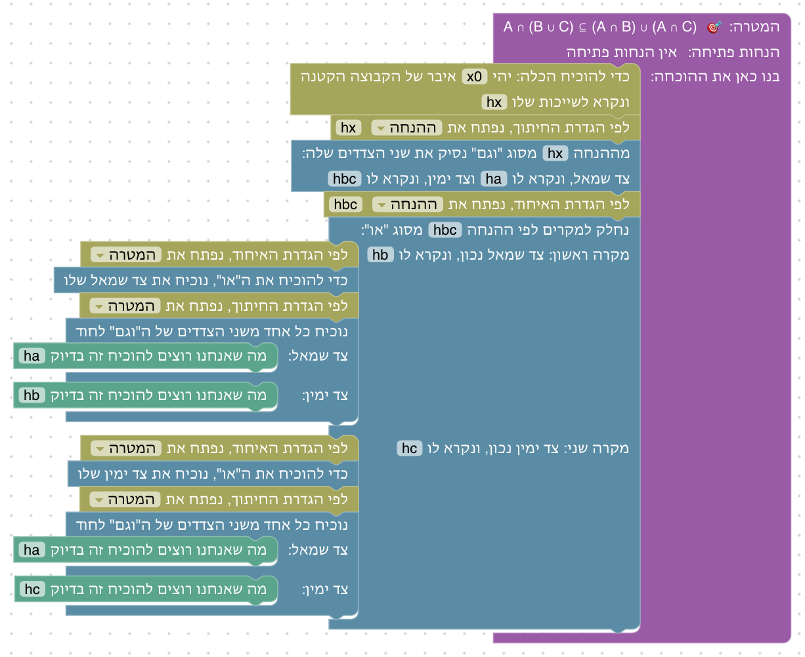

**שיקולים ושאלות להכרעה.**
- האם להפוך את השלב לשוויון מלא (שתי הכלות)? זה כפול באורך.

### שלב 5.9: משלים

`⊢ (A ⊆ B) → (Bᶜ ⊆ Aᶜ)` · בארגז: נניח, הוכחת הכלה, שימוש בהכלה, הגדרת המשלים, הוכחת שלילה, סתירה

**מה לומדים.** מה זה משלים: שלילה של שייכות.

**למה כך.** הכיוון הזה לא דורש הוכחה בשלילה (הכיוון ההפוך דורש). הוא מקביל ל־modus tollens משלב 3.5.

**פתרון.** פותחים את הגדרת המשלים, ומוכיחים שלילה: x0 ∈ A היה נותן x0 ∈ B.

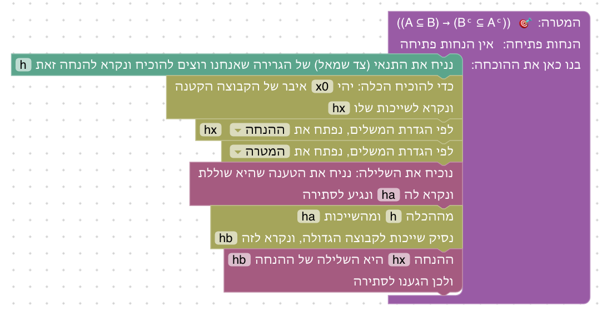

**שיקולים ושאלות להכרעה.**
- המשלים תלוי בתחום (כל העצמים שלא ב־A). בקורס זה בדרך כלל "קבוצה אוניברסלית" U. האם להציג את התחום כקבוצה אוניברסלית?

### שלב 5.10: הפרש

`⊢ A \ B ⊆ A ∩ Bᶜ` · בארגז: הוכחת הכלה, הגדרות ההפרש, החיתוך והמשלים, שימוש והוכחה של "וגם", זה בדיוק

**מה לומדים.** מה זה הפרש, ושאותה קבוצה יכולה להיות מוגדרת בשתי דרכים.

**למה כך.** שלוש פתיחות הגדרה שונות באותה הוכחה, כך שהסטודנט צריך לבחור בכל פעם את הבלוק הנכון.

**פתרון.** פותחים את ההפרש בהנחה, ואת החיתוך והמשלים במטרה.

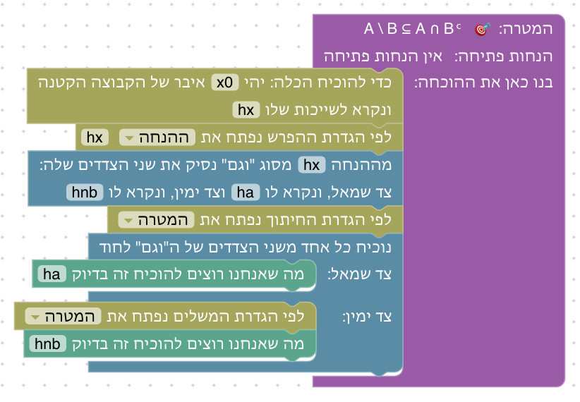

### שלב 5.11: תרגיל מסכם: חוק דה מורגן לקבוצות

`⊢ (A ∪ B)ᶜ = Aᶜ ∩ Bᶜ` · בארגז: כל הבלוקים של היחידה עד כה, ושלילה מיחידה 3 (בלי הסקה קדימה)

**מה לומדים.** לשלב שוויון, משלים, איחוד וחיתוך בהוכחה אחת.

**למה כך.** חוק דה מורגן משלב 3.6 בשפת הקבוצות. הכיוון הזה קונסטרוקטיבי בשתי ההכלות (Set Theory Game ו־D∃∀duction מלמדים אותו).

**פתרון.** שתי הכלות; בכל אחת פותחים הגדרות ומשתמשים בשלילה, כמו בשלב 3.6.

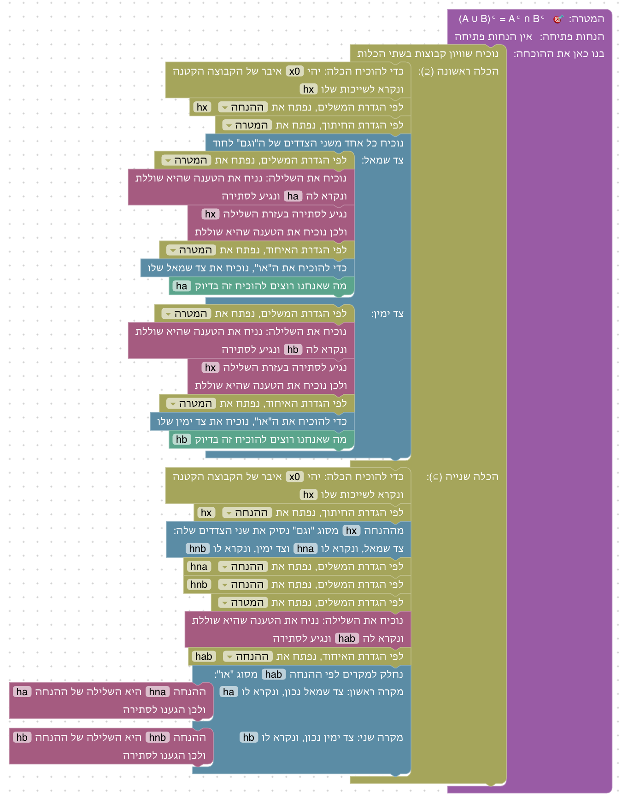

**שיקולים ושאלות להכרעה.**
- ההוכחה ארוכה מאוד (28 בלוקים). האם זה מתאים כתרגיל מסכם, או שעדיף הכלה אחת בלבד?

### שלב 5.12: הקבוצה הריקה

`⊢ ∅ ⊆ A` · בארגז: הוכחת הכלה, הגדרת הקבוצה הריקה, סתירה גוררת, מעבר לתנאי, הסקה קדימה, זה בדיוק

**מה לומדים.** מה זו הקבוצה הריקה, ולמה היא מוכלת בכל קבוצה.

**למה כך.** טענה שסטודנטים מתקשים להבין ("אבל אין בה כלום"). ההוכחה מראה למה: האיבר של ∅ הוא סתירה, ומסתירה נובע הכול (שלב 3.3).

**פתרון א: אחורה.** האיבר של ∅ הוא סתירה; סתירה גוררת x0 ∈ A.

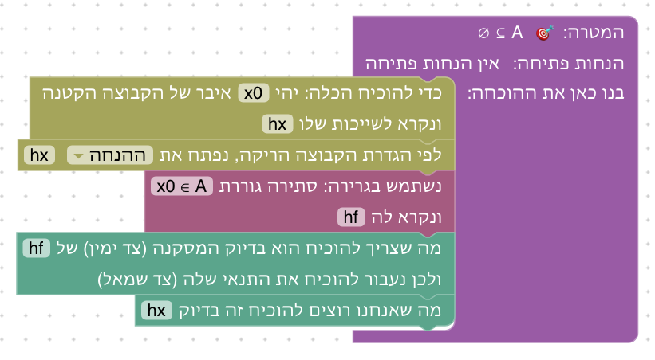

**פתרון ב: קדימה.** מהסתירה ומ"סתירה גוררת x0 ∈ A" נובע x0 ∈ A.

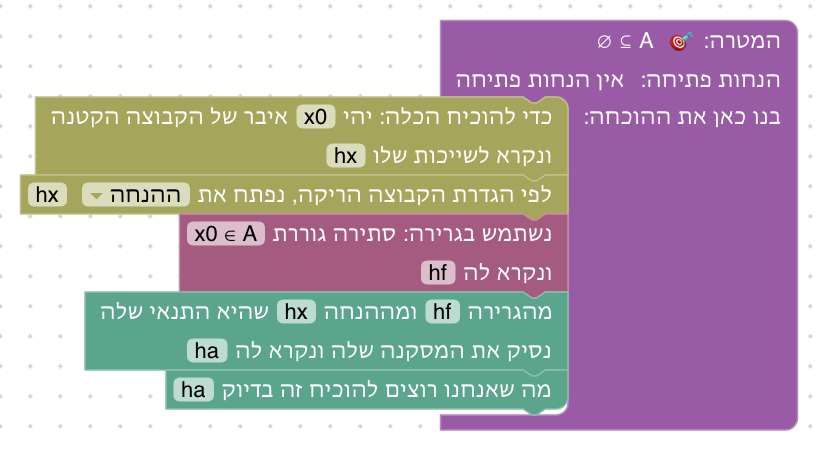

**שיקולים ושאלות להכרעה.**
- הסטודנט צריך להקליד את הנוסחה "x0 ∈ A" בבלוק "סתירה גוררת", כולל הסימן ∈. אין דרך נוחה להקליד אותו. האם להוסיף מקלדת סימנים, או בלוק "מסתירה נובעת המטרה" שלא דורש הקלדה?

### שלב 5.13: קבוצה ומשלימה

`⊢ A ∩ Aᶜ = ∅` · בארגז: שוויון, הוכחת הכלה, הגדרות החיתוך, המשלים והקבוצה הריקה, "וגם", שלילה, סתירה, סתירה גוררת, מעבר לתנאי, זה בדיוק

**מה לומדים.** להוכיח שקבוצה ריקה, ועיקרון הסתירה בשפת הקבוצות.

**למה כך.** שוויון לקבוצה הריקה הוא דפוס נפוץ (D∃∀duction מנסח אותו במפורש: A = ∅ ↔ ∀x, x ∉ A). שתי ההכלות שונות מאוד: אחת מגיעה לסתירה, השנייה משתמשת בה.

**פתרון.** הכלה ראשונה מגיעה לסתירה; בשנייה, מסתירה נובע כל צד.

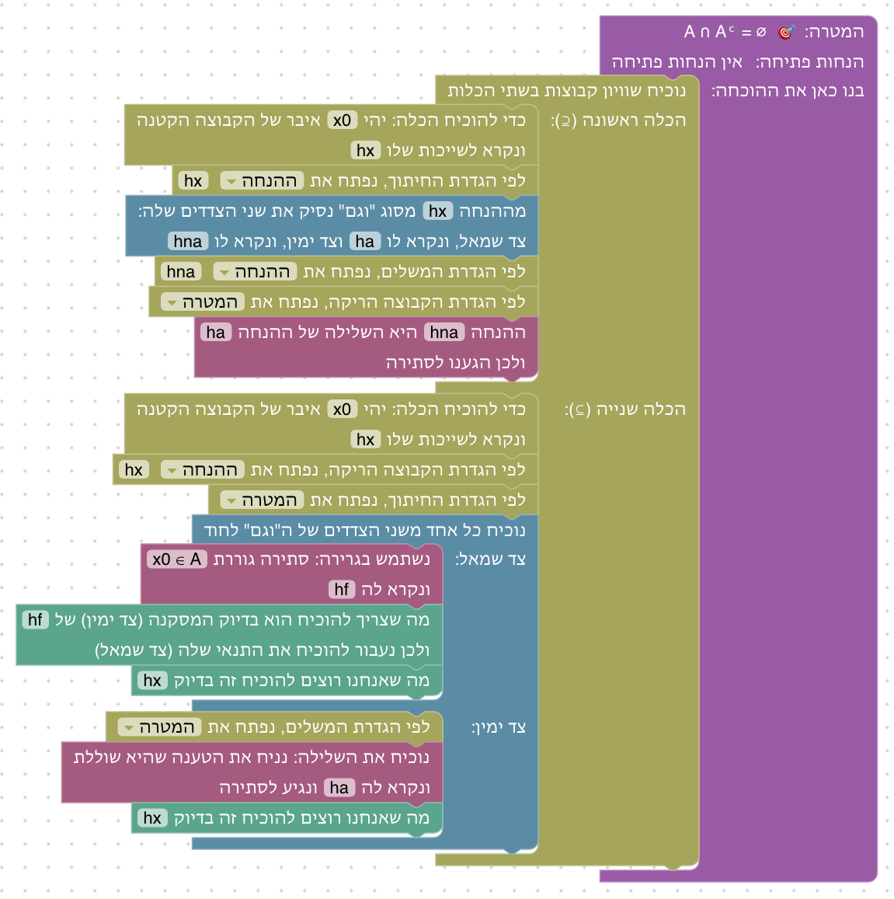

**שיקולים ושאלות להכרעה.**
- כמו בשלב 5.12, צריך להקליד "x0 ∈ A". ראו שם.

### שלב 5.14: קבוצת החזקה

`⊢ (A ⊆ B) → (𝒫(A) ⊆ 𝒫(B))` · בארגז: נניח, הוכחת הכלה, שימוש בהכלה, הגדרת קבוצת החזקה, זה בדיוק

**מה לומדים.** מה זו קבוצת חזקה, ושאיברים של קבוצה יכולים להיות בעצמם קבוצות.

**למה כך.** האיבר שלוקחים הוא קבוצה (X), אבל ההוכחה זהה לכל הכלה אחרת. החלונית מציגה את X בשורת הקבוצות.

**פתרון.** האיבר הוא קבוצה X; אחרי פתיחת ההגדרה, שרשרת הכלות.

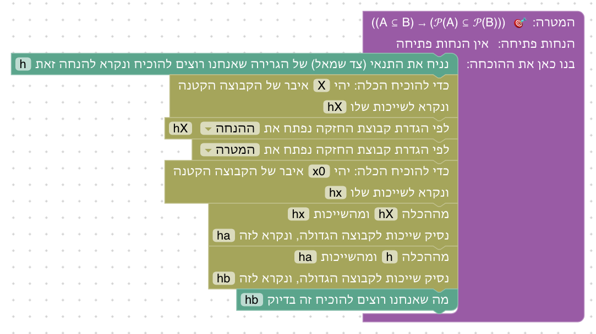

### שלב 5.15: איחוד של משפחה

`hA : A ∈ F ⊢ A ⊆ ⋃₀ F` · בארגז: הוכחת הכלה, הגדרת איחוד המשפחה, הוכחת "קיים", הוכחת "וגם", צירוף ל"וגם", זה בדיוק

**מה לומדים.** מה זה איחוד של משפחה: טענת "קיים".

**למה כך.** ב־Set Theory Game משפחות הן עולמות נפרדים, שבעיקר מתרגלים שוב כמתים. כאן שני שלבים מספיקים כדי להראות את הקשר: איחוד הוא "קיים", וחיתוך הוא "לכל".

**פתרון.** שייכות לאיחוד המשפחה היא "קיים": העד הוא A.

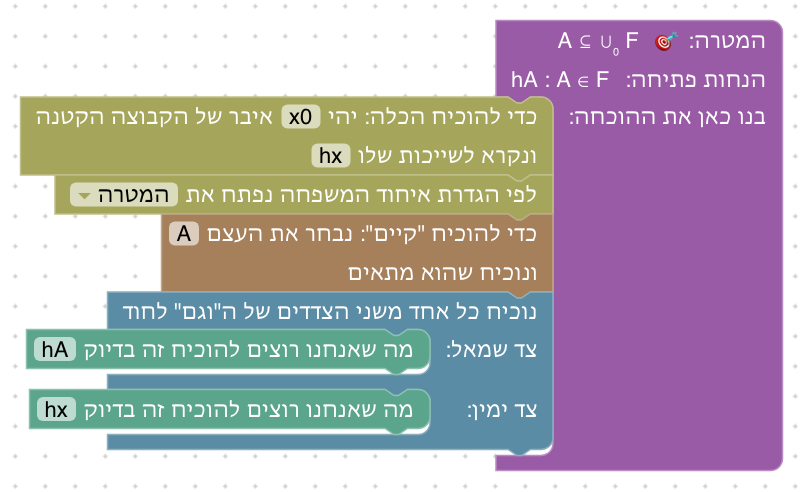

### שלב 5.16: חיתוך של משפחה

`hA : A ∈ F ⊢ ⋂₀ F ⊆ A` · בארגז: הוכחת הכלה, הגדרת חיתוך המשפחה, שימוש ב"לכל", מעבר לתנאי, הסקה קדימה, זה בדיוק

**מה לומדים.** מה זה חיתוך של משפחה: טענת "לכל", שמציבים בה קבוצה.

**פתרון.** שייכות לחיתוך המשפחה היא "לכל": מציבים את A.

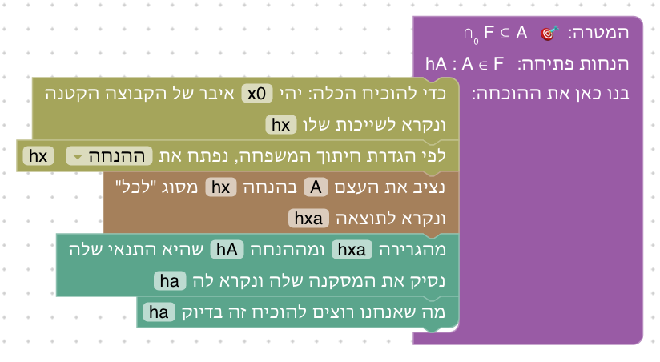

**שיקולים ושאלות להכרעה.**
- האם משפחות של קבוצות שייכות ליחידה הזאת, או ליחידה נפרדת (כמו ב־Set Theory Game)?

### שלב 5.17: שלב בונוס: משלים של משלים

`⊢ (Aᶜ)ᶜ = A` · בארגז: שוויון, הוכחת הכלה, הגדרת המשלים, הוכחת שלילה, שימוש בשלילה, הוכחה בשלילה, סתירה, זה בדיוק

**מה לומדים.** שלילה כפולה בשפת הקבוצות, ומתי מוכיחים בשלילה: כשהמטרה אינה שלילה.

**למה כך.** מקביל לשלבים 3.4 ו־3.7, באותה הוכחה.

**פתרון.** הכלה ראשונה בהוכחה בשלילה; השנייה בהוכחת שלילה.

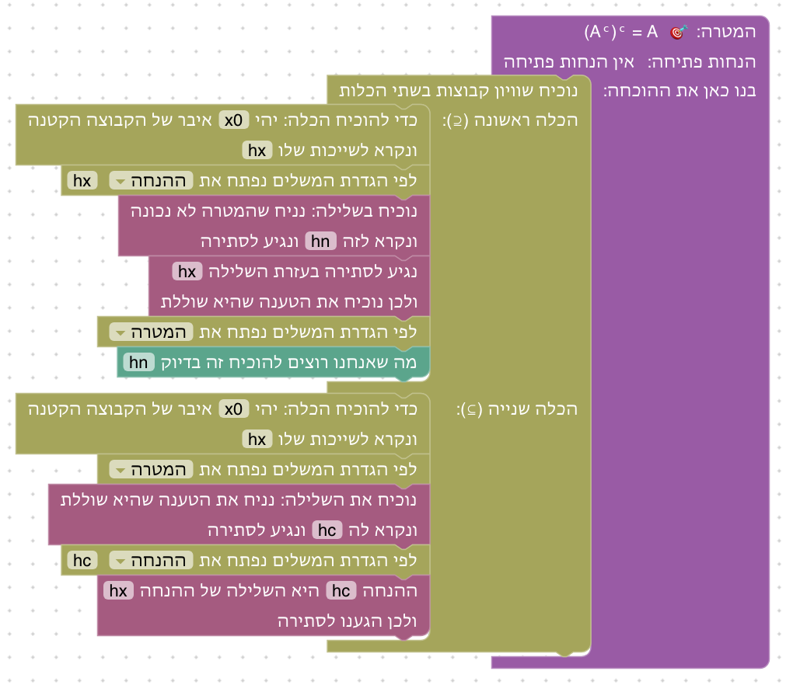

## רקע: מה עושים מדריכים אחרים

- **Set Theory Game** ([STG4](https://github.com/djvelleman/STG4)): עולמות הכלה, משלים, חיתוך, איחוד, שילובים, ושלושה עולמות של משפחות; 51 שלבים. הכלה משמשת כמו גרירה ("h1 h2 is a proof of x ∈ B"), ∩ ∪ ᶜ נפתחים בלמות שייכות ("write out the meaning of intersection"), ושוויון מוכח בשתי הכלות ואחר כך ב־ext.
- **Verbose Lean:** "Fix x ∈ A" להוכחת הכלה, "Since A ⊆ B and x ∈ A we get that x ∈ B" לשימוש בה; שייכות לחיתוך ולאיחוד משמשת ישירות במהלכים של "וגם" ו"או", בלי צעד פתיחה.
- **D∃∀duction** (קורסי ENSEMBLES): כל הגדרה מנוסחת כשקילות, והמורה קובע אילו הגדרות נפתחות ביד. בין התרגילים: חילוף, פילוג, דה מורגן, (Aᶜ)ᶜ = A, והפרשים.
- **Mechanics of Proof (פרק 9), Mathematics in Lean (4.1), Logic and Proof ("Sets"):** קבוצות מוגדרות דרך שייכות; שוויון בשתי הכלות; MIL מראה שלוש דרכים לפתוח הגדרה (rw, simp, או לתת ל־Lean לפתוח בעצמו).
- **קונסטרוקטיבי מול קלאסי** (ניתוח, לא בדיקה במקור): דורשים עיקרון קלאסי (Aᶜ)ᶜ ⊆ A, (A ∩ B)ᶜ ⊆ Aᶜ ∪ Bᶜ, Bᶜ ⊆ Aᶜ → A ⊆ B, ו־A ∪ Aᶜ = התחום; קונסטרוקטיביים שני חוקי הפילוג, (A ∪ B)ᶜ = Aᶜ ∩ Bᶜ, ו־A ⊆ B → Bᶜ ⊆ Aᶜ.

## שאלות כלליות להכרעה

- **אורך היחידה:** 17 שלבים, חלקם ארוכים מאוד (5.11, 5.13). כדאי לפצל, למשל ליחידת "קבוצות" וליחידת "קבוצת חזקה ומשפחות".
- **הקלדת סימנים:** כשצריך להקליד נוסחה (בבלוק "סתירה גוררת"), אין דרך נוחה להקליד ∈ ⊆ ∩ ᶜ. מקלדת סימנים קטנה ליד אזור העבודה תפתור זאת גם ליחידות הבאות.
- **"טענות שהוכחו":** כמה שלבים בונים פעמיים אותה הכלה. מנגנון שמאפשר להשתמש בטענה משלב קודם (כמו ב־Set Theory Game וב־D∃∀duction) יקצר אותם.
- **פתיחה אוטומטית:** כרגע כל פתיחת הגדרה היא בלוק מפורש. אחרי שהסטודנטים שולטים בה, אפשר לשקול שהבלוקים של "וגם" ו"או" יפעלו ישירות על חיתוך ואיחוד, כמו ב־Verbose Lean.

