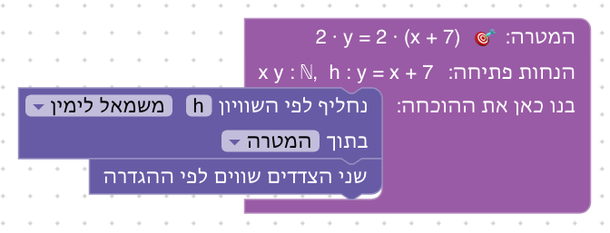
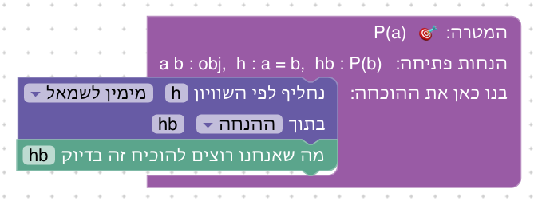
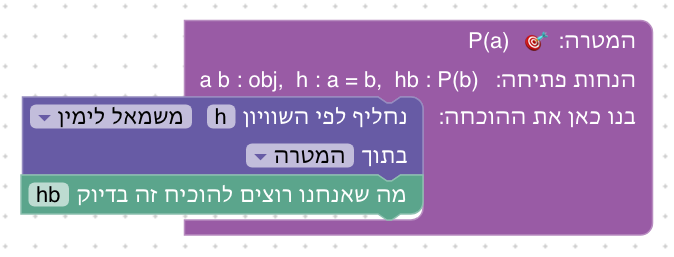
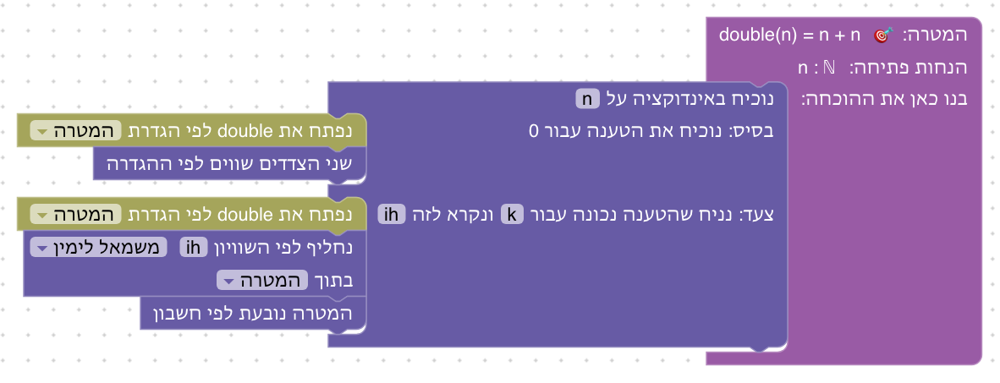
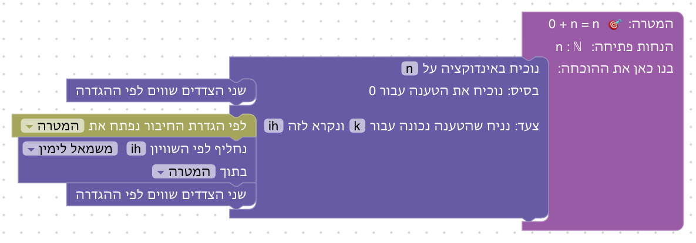
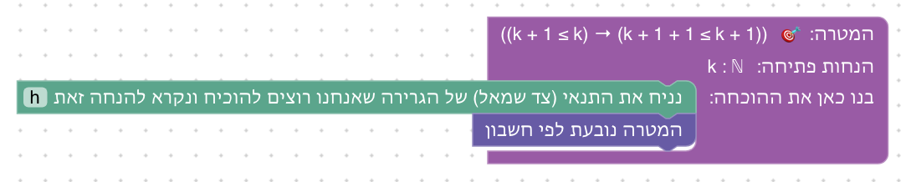
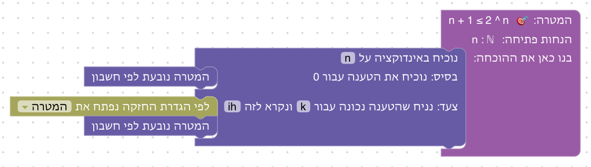
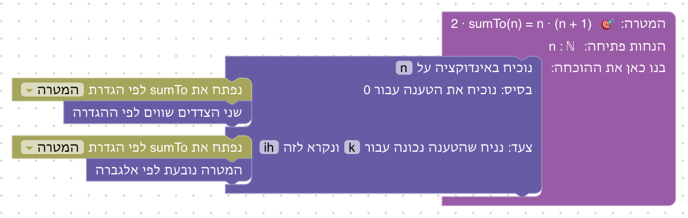
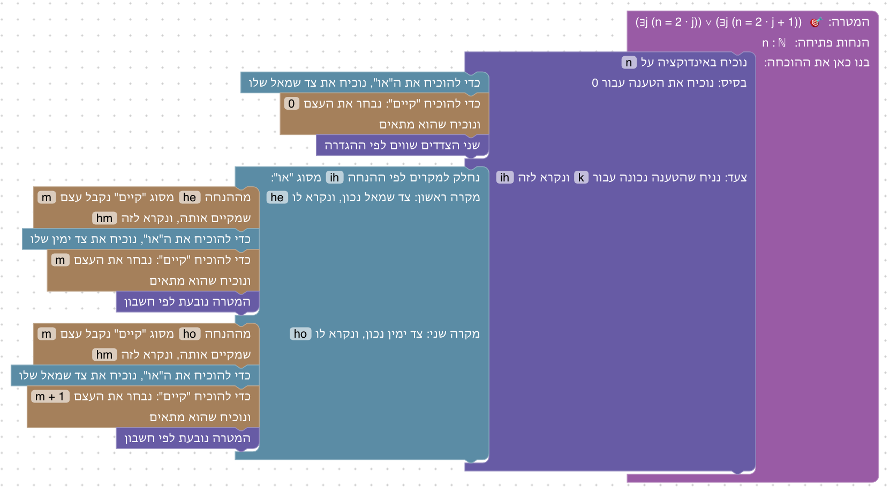

# יחידה 6 — שוויון ואינדוקציה

**מטרה:** שוויון כעיקרון לוגי (רפלקסיביות והחלפת שווה בשווה, ומהם סימטריה וטרנזיטיביות), והוכחה באינדוקציה על המספרים הטבעיים: בסיס, צעד והנחת אינדוקציה. הסטודנט מבין למה צריך גם בסיס וגם צעד, ומבחין בין מה שנכון לפי ההגדרה לבין מה שדורש הוכחה.

## הבלוקים

| כלל | כיתוב הבלוק | Lean | לפני → אחרי |
|---|---|---|---|
| שוויון לפי ההגדרה (=I) | שני הצדדים שווים לפי ההגדרה | `rfl` | `⊢ n + 0 = n` ⟶ סגור |
| החלפה לפי שוויון (=E) | נחליף לפי השוויון h [משמאל לימין / מימין לשמאל] בתוך [המטרה / ההנחה h'] | `rewrite [h]`, `rewrite [← h]`, `… at h'` | `h : y = x + 7 ⊢ 2·y = …` ⟶ `⊢ 2·(x + 7) = …` |
| אינדוקציה | נוכיח באינדוקציה על n; בסיס: נוכיח את הטענה עבור 0 … צעד: נניח שהטענה נכונה עבור k ונקרא לזה ih … | `induction n with \| zero => … \| succ k ih => …` | שני חלקים: בסיס (n = 0) וצעד (k + 1, עם `ih`) |
| פתיחת הגדרה (בלוק לכל הגדרה) | לפי הגדרת double / sumTo / oddSum / החיבור / החזקה נפתח את [המטרה / ההנחה] | `rewrite [double]`, `rewrite [easylean_add_succ]`, `rewrite [Nat.pow_succ]` | `double(k + 1)` ⟶ `double(k) + 2` |
| חשבון | המטרה נובעת לפי חשבון | `omega` | סוגר חשבון לינארי, בעזרת ההנחות |
| אלגברה | המטרה נובעת לפי אלגברה | `grind` | סוגר אלגברה (פתיחת סוגריים), בעזרת ההנחות |

**פונקציות משלנו, בהגדרה רקורסיבית.** `double`, `sumTo` ו־`oddSum` מוגדרות ב־`NAT_PRELUDE` (`frontend/src/generator/lean.js`), שנטען רק בשלבים של היחידה (`usesNat`), עם שתי משוואות לכל אחת (עבור 0 ועבור k + 1), וכך פתיחת ההגדרה היא צעד גלוי. גם החיבור מוגדר לפי המחובר השני (`n + (m + 1) = (n + m) + 1`), ולכן `n + 0 = n` נכון לפי ההגדרה, אבל `0 + n = n` דורש אינדוקציה, כמו ב־Natural Number Game.

**חשבון בלי להסתיר את הלוגיקה.** בלוקי החשבון והאלגברה (`omega`, ו־`grind`, שניהם ב־Lean הבסיסי, בלי Mathlib) משלימים את מה שאינו עיקר השלב. הם לא פותחים את ההגדרות שלנו (נבדק: שניהם נכשלים לפני הפתיחה), ולכן פתיחת ההגדרה נשארת אצל הסטודנט, וההסבר בכישלון אומר לו את זה ("החשבון לבדו לא מספיק… אולי צריך קודם לפתוח הגדרה, או להחליף לפי הנחת האינדוקציה?"). הם כן רואים את ההנחות, כולל הנחת האינדוקציה (ראו שאלות). בשלבים שבהם השוויון או האינדוקציה עצמם הם העיקר (6.1–6.4, 6.6) אין בלוקי חשבון בארגז.

**תצוגה.** הפונקציות מוצגות בסימון הקורס (`double(n)`, ולא `double n`), וכפל כ־`·`. מספרים מוצגים בחלונית בשורה נפרדת, "מספרים: n", כמו עצמים וקבוצות. חלקי האינדוקציה נקראים "בסיס" ו"צעד".

## שלבים

לכל שלב: מה לומדים בו, למה הוא בנוי כך, איך אנחנו רוצים שסטודנטים יפתרו אותו, ושיקולים ושאלות שעוד צריך להכריע. צילומי הפתרונות נוצרים מ־`frontend/e2e/solutions.js` (ראו [יחידה 0](00-getting-started.md#שלבים)).

**סדר היחידה.** קודם שוויון (6.1–6.4), כי האינדוקציה משתמשת בהחלפה בכל צעד, ואחר כך אינדוקציה (6.5–6.10) ובונוס (6.11).

### שלב 6.1: שוויון לפי ההגדרה

`n ⊢ n + 0 = n` · בארגז: שוויון לפי ההגדרה

**מה לומדים.** רפלקסיביות: שוויון ששני צדדיו זהים לפי ההגדרות מוכח מיד. ומספרים טבעיים, עם הגדרת החיבור.

**למה כך.** כמו הרמה הראשונה של Natural Number Game. הטענה נבחרה כך שהיא נכונה לפי ההגדרה, כדי שבשלב 6.6 יהיה ניגוד ל־`0 + n = n`, שאינה.

**פתרון.** n + 0 = n לפי הגדרת החיבור.

### שלב 6.2: מחליפים לפי שוויון

`x, y, h : y = x + 7 ⊢ 2·y = 2·(x + 7)` · בארגז: החלפה לפי שוויון, שוויון לפי ההגדרה

**מה לומדים.** העיקרון של החלפת שווה בשווה (=E, חוק לייבניץ).

**למה כך.** אותה דוגמה כמו ב־Natural Number Game ("substitute in for y"). ההחלפה לא סוגרת את המטרה בעצמה (`rewrite`, לא `rw`), כך שהסטודנט רואה ששני הצדדים נעשו זהים, וסוגר בעיקרון של שלב 6.1.

**פתרון.** מחליפים את y ב־x + 7, ושני הצדדים זהים.

### שלב 6.3: כיוון ההחלפה

`a, b, h : a = b, hb : P(b) ⊢ P(a)` · בארגז: החלפה לפי שוויון, הסקה קדימה, זה בדיוק · השלב נפתח עם החלפה בכיוון הלא נכון

**מה לומדים.** שלשוויון יש שני כיוונים, ושצריך לבחור כיוון ומקום.

**למה כך.** החלפה בכיוון הלא נכון היא טעות נפוצה, ו־Natural Number Game מקדיש לה שלב. כאן השלב נפתח איתה: החלפה משמאל לימין בהנחה hb, שאין בה a. ההסבר: "ב־P(b) לא מופיע a, ולכן אין מה להחליף. אולי צריך להחליף בכיוון השני, או במקום אחר?". התחום מופשט (כמו ביחידה 4), כדי להראות שהשוויון אינו רק של מספרים.

**פתרון א: בהנחה.** מימין לשמאל בהנחה hb: b מוחלף ב־a.

**פתרון ב: במטרה.** משמאל לימין במטרה: a מוחלף ב־b.

### שלב 6.4: שרשרת של שוויונות

`a, b, c, h1 : a = b, h2 : b = c ⊢ a = c` · בארגז: החלפה לפי שוויון, שוויון לפי ההגדרה, הסקה קדימה, זה בדיוק

**מה לומדים.** טרנזיטיביות, כתוצאה של העיקרון של החלפה.

**למה כך.** forall x מראה שסימטריה וטרנזיטיביות נובעות משני העקרונות של 6.1 ו־6.2 בלבד; כאן רואים זאת בפועל. טקסט הסיום מזכיר גם את הסימטריה.

**פתרון.** מחליפים את a ב־b במטרה, ומקבלים את h2.

**שיקולים ושאלות להכרעה.**
- הטיוטה הקודמת כללה בלוק של שרשרת חישוב (`calc`). כאן שרשרת מתקבלת מהחלפות רצופות. האם צריך בלוק נפרד לשרשרת "a = b = c", כמו ב־Waterproof וב־Verbose Lean?

### שלב 6.5: אינדוקציה ראשונה

`n ⊢ double(n) = n + n` · בארגז: אינדוקציה, הגדרת double, החלפה לפי שוויון, שוויון לפי ההגדרה, חשבון, הסקה קדימה, זה בדיוק

**מה לומדים.** אינדוקציה: בסיס, צעד, והנחת האינדוקציה. ופתיחת הגדרה רקורסיבית.

**למה כך.** פונקציה פשוטה שמוגדרת ברקורסיה, כך שהמבנה של ההוכחה (פתיחת ההגדרה, החלפה לפי הנחת האינדוקציה, חשבון) בולט. הטקסט מסביר את האינדוקציה כשרשרת "מ־0 ל־1, מ־1 ל־2". הבלוק מפצל את ההוכחה לשני חלקים, כמו הבלוקים של יחידה 2, וכך אי אפשר לשכוח את הבסיס.

**פתרון.** בבסיס פותחים את double; בצעד גם מחליפים לפי הנחת האינדוקציה, ואת השאר משלים חשבון.

**שיקולים ושאלות להכרעה.**
- בלוק החשבון רואה את הנחת האינדוקציה, ולכן בצעד אפשר לדלג על ההחלפה לפיה (אבל לא על פתיחת ההגדרה). האם להגביל את בלוק החשבון כך שלא יראה את ההנחות, כדי שהשימוש בהנחת האינדוקציה יהיה מפורש תמיד?

### שלב 6.6: 0 + n = n

`n ⊢ 0 + n = n` · בארגז: אינדוקציה, הגדרת החיבור, החלפה לפי שוויון, שוויון לפי ההגדרה, הסקה קדימה, זה בדיוק

**מה לומדים.** שטענה שנראית מובנת מאליה יכולה לדרוש אינדוקציה, ולהבחין בין "לפי ההגדרה" ל"לפי הוכחה".

**למה כך.** הניגוד ל־6.1, כמו ב־Natural Number Game ("Wait, don't we already know that? No!"). אין חשבון בארגז: כל צעד הוא פתיחת הגדרה או החלפה. אם הסטודנט מנסה "לפי ההגדרה" ישירות, ההסבר אומר ששני הצדדים לא שווים לפי ההגדרות בלבד.

**פתרון.** בצעד פותחים את הגדרת החיבור ומחליפים לפי הנחת האינדוקציה; בלי חשבון.

### שלב 6.7: צעד בלי בסיס

`k ⊢ (k + 1 ≤ k) → (k + 1 + 1 ≤ k + 1)` · בארגז: נניח, חשבון, הסקה קדימה, זה בדיוק

**מה לומדים.** למה הבסיס נחוץ: לטענה שקרית (n + 1 ≤ n) יש צעד נכון.

**למה כך.** התרגיל "Propriété héréditaire mais fausse" של D∃∀duction, נגד הטעות הנפוצה שהבסיס הוא פורמליות. הסטודנט מוכיח את הצעד בעצמו, וטקסט הסיום מראה שהבסיס נכשל, ולכן השרשרת לא מתחילה.

**פתרון.** הצעד נכון לפי חשבון; הבסיס הוא שלא נכון.

**שיקולים ושאלות להכרעה.**
- השלב מתבסס על הסבר בטקסט יותר מאשר על ההוכחה (הקצרה). חלופה: לתת לסטודנט לנסות להוכיח את הטענה כולה באינדוקציה, ולהיתקע בבסיס. זה דורש שלב שאין לו פתרון, ואין לנו מנגנון כזה.

### שלב 6.8: אינדוקציה ואי־שוויון

`n ⊢ n + 1 ≤ 2^n` · בארגז: אינדוקציה, הגדרת החזקה, חשבון, הסקה קדימה, זה בדיוק

**מה לומדים.** שאינדוקציה מוכיחה גם אי־שוויונות.

**למה כך.** הדוגמה הראשונה ב־Mechanics of Proof. אחרי פתיחת הגדרת החזקה, החשבון לינארי (2^k הוא "איבר" אחד), ולכן מספיק בלוק החשבון.

**פתרון.** בצעד פותחים את הגדרת החזקה, ואז חשבון עם הנחת האינדוקציה.

### שלב 6.9: סכום המספרים

`n ⊢ 2 · sumTo(n) = n · (n + 1)` · בארגז: אינדוקציה, הגדרת sumTo, החלפה, שוויון לפי ההגדרה, חשבון, אלגברה, הסקה קדימה, זה בדיוק

**מה לומדים.** את נוסחת הסכום הקלאסית, ואת בלוק האלגברה.

**למה כך.** הנוסחה דורשת כפל של משתנים, ולכן היא לא בטווח של בלוק החשבון; `grind` (ב־Lean הבסיסי) עושה את האלגברה. הנוסחה נוסחה כ־"פעמיים הסכום", כדי להימנע מחילוק במספרים טבעיים (אזהרה של HTPI).

**פתרון.** פותחים את sumTo; בצעד, אלגברה עם הנחת האינדוקציה.

### שלב 6.10: תרגיל מסכם: זוגי או אי־זוגי

`n ⊢ (∃j (n = 2 · j)) ∨ (∃j (n = 2 · j + 1))` · בארגז: אינדוקציה, חלוקה למקרים, צד שמאל, צד ימין, שימוש והוכחה של "קיים", שוויון לפי ההגדרה, חשבון, הסקה קדימה, זה בדיוק

**מה לומדים.** אינדוקציה יחד עם הכלים של יחידות 2 ו־4: הנחת האינדוקציה היא "או", ובכל מקרה יש לבחור עד.

**למה כך.** התרגיל מופיע ב־D∃∀duction וב־Mechanics of Proof. הוא מראה שהנחת האינדוקציה היא הנחה רגילה, שמשתמשים בה בכל הכלים.

**פתרון.** בצעד, מקרים לפי הנחת האינדוקציה; בכל מקרה עד מתאים, וחשבון.

**שיקולים ושאלות להכרעה.**
- העד `m + 1` מוקלד בשדה. זו הפעם הראשונה שעד הוא ביטוי ולא שם. האם להסביר זאת בטקסט?

### שלב 6.11: שלב בונוס: סכום האי־זוגיים

`n ⊢ oddSum(n) = n · n` · בארגז: אינדוקציה, הגדרת oddSum, החלפה, שוויון לפי ההגדרה, אלגברה, הסקה קדימה, זה בדיוק

**מה לומדים.** אינדוקציה עם נוסחה נוספת, הפעם בלי עזרה מפורטת.

**למה כך.** הבונוס שהוצע במקור, `3 ∣ n³ + 2n`, לא עובר ב־Lean הבסיסי גם עם `grind`; סכום האי־זוגיים הוא תרגיל קלאסי שעובר. הטקסט מראה את הדוגמאות הראשונות (1, 4, 9) כדי שהסטודנט יראה את הדפוס לפני ההוכחה.

**פתרון.** פותחים את oddSum, מחליפים לפי הנחת האינדוקציה, ואלגברה.

## רקע: מה עושים מדריכים אחרים

- **שוויון כלוגיקה:** forall x (פרק 39) מגדיר שני כללים, =I ("c = c") ו־=E (החלפה, חוק לייבניץ), ומוכיח מהם סימטריה וטרנזיטיביות.
- **Natural Number Game** ([NNG4](https://github.com/leanprover-community/NNG4)): עולם ההדרכה (rfl, rw, כיוון ההחלפה עם ←, "החלפה מדויקת") ועולם החיבור (0 + n = n כאינדוקציה ראשונה, ואחר כך חילוף וקיבוץ). המשחק בונה את המספרים, החיבור והכפל בעצמו, ולכן כל צעד הוא החלפה לפי הגדרה או טענה קודמת, בלי אוטומציה.
- **ניסוח:**
  - Verbose Lean: "We rewrite using h", "Calc a = b by hypothesis"; לאינדוקציה "Let's prove by induction".
  - Waterproof: "We use induction on n. We first show the base case… We now show the induction step."
  - D∃∀duction: "Choose which expression you want to replace"; "Base case / Induction step".
- **סדרות תרגילים:**
  - HTPI 6.1: `3 ∣ n³ + 2n`, סכום חזקות של 2, `2ⁿ > n²` עבור n ≥ 5.
  - Mechanics of Proof 6: `2ⁿ ≥ n + 1`, זוגי או אי־זוגי, שאריות.
  - D∃∀duction: סדרות, ו"תכונה שעוברת מ־n ל־n + 1 אבל לא נכונה".
- **טעויות נפוצות:**
  - שכחת הבסיס, או מחשבה שהוא לא נחוץ. ממנה נולד שלב 6.7.
  - החלפה בכיוון הלא נכון. ממנה נולד שלב 6.3.
  - בלבול בין `n + 0 = n` לבין `0 + n = n`. ממנו נולד שלב 6.6.
  - שימוש בהנחת האינדוקציה לפני שהצד שלה מופיע במטרה.
- **מקורות:**
  - [forall x, פרק 39](https://forallx.openlogicproject.org/html/Ch39.html)
  - [How To Prove It with Lean, 6.1](https://djvelleman.github.io/HTPIwL/Chap6.html)
  - [The Mechanics of Proof, 6](https://hrmacbeth.github.io/math2001/06_Induction.html)
  - [Logic and Proof](https://leanprover-community.github.io/logic_and_proof/the_natural_numbers_and_induction.html)

## שאלות כלליות להכרעה

- **חשבון שרואה את ההנחות:** ראו שלב 6.5. כרגע בלוקי החשבון והאלגברה משתמשים בכל ההנחות, כולל הנחת האינדוקציה.
- **"טענות שהוכחו":** כמו ב־Natural Number Game, אפשר היה להשתמש ב־`0 + n = n` משלב 6.6 בשלבים הבאים. זה עלה גם ביחידות 2 ו־5.
- **אינדוקציה חזקה ואינדוקציה מנקודה מסוימת** (n ≥ 5): לא נכללו. האם להוסיף?
- **הקלדת סימנים:** העד `m + 1` ונוסחאות אחרות מוקלדים בשדות. מקלדת סימנים (ראו יחידה 5) תעזור גם כאן.

